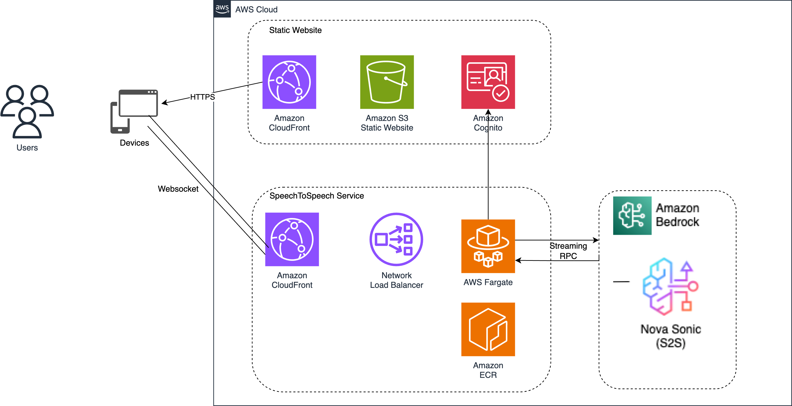

# Nova Sonic Solution

A real-time speech-to-speech communication platform powered by Amazon Bedrock's Nova model for advanced language processing and AWS real-time messaging capabilities, featuring a Java WebSocket server and React frontend. Nova enables natural, context-aware speech-to-speech conversations through its state-of-the-art language understanding and generation capabilities.

## Architecture Overview



The solution consists of three main components:

1. **Frontend Application**
   - React + TypeScript application
   - Real-time WebSocket communication
   - AWS Amplify for authentication
   - Tailwind CSS for styling

2. **Backend Infrastructure**
   - AWS CDK for infrastructure as code
   - Java WebSocket server running on AWS Fargate
   - Amazon Cognito for user authentication
   - CloudFront for content delivery
   - S3 for static website hosting
   - Network Load Balancer for WebSocket traffic

3. **Development Tools**
   - Load testing suite for WebSocket performance testing
   - Automated deployment pipeline
   - CDK Nag for security best practices

## Project Structure

```
.
├── frontend/           # React + TypeScript frontend application
├── backend/           # AWS CDK infrastructure and Java WebSocket server
│   ├── app/          # Java WebSocket server implementation
│   ├── stack/        # CDK infrastructure code
│   └── load-test/    # WebSocket load testing suite
└── images/           # Architecture diagrams and documentation images
```

## Prerequisites

- Node.js 18.x or later
- Java 17 or later
- AWS CLI configured with appropriate credentials
- AWS CDK CLI installed globally
- Docker installed and running

## Getting Started

1. Clone the repository:
   ```bash
   # Clone from GitHub
   git clone https://github.com/aws-samples/generative-ai-cdk-constructs-samples.git
   ```

2. Configure AWS CLI with your credentials and region:
   ```bash
   aws configure
   ```
   Ensure you set the appropriate AWS region where you want to deploy the solution.

3. Build the frontend first (required for backend deployment):
   ```bash
   cd NovaSonicSolution/frontend
   ```
   Follow the [Frontend Build Instructions](frontend/README.md#aws-deployment)

4. Deploy the backend (includes frontend deployment):
   ```bash
   cd ../backend
   ```
   Follow the [Backend Deployment Instructions](backend/README.md#aws-deployment)

5. Access the application through the CloudFront URL provided in the CDK outputs

```bash
https://$CLOUDFRONT_URL/
```

 
## Security Features

- AWS Cognito user authentication
- HTTPS/WSS encryption for all communications
- CDK Nag integration for security best practices
- Server access logging
- AWS WAF integration (optional)

## Development Guidelines

- Follow the AWS Well-Architected Framework
- Use CDK constructs for infrastructure components
- Implement proper error handling and logging
- Follow security best practices outlined by CDK Nag
- Write comprehensive tests for both frontend and backend

## Contributing

1. Fork the repository
2. Create a feature branch
3. Commit your changes
4. Push to the branch
5. Create a Pull Request

## Clean Up

To clean up and remove all resources deployed by this solution:

1. Follow the [backend cleanup instructions](backend/README.md#clean-up) to remove backend resources
2. Delete any additional CloudWatch log groups created during testing
3. Ensure all S3 buckets are emptied before deletion
