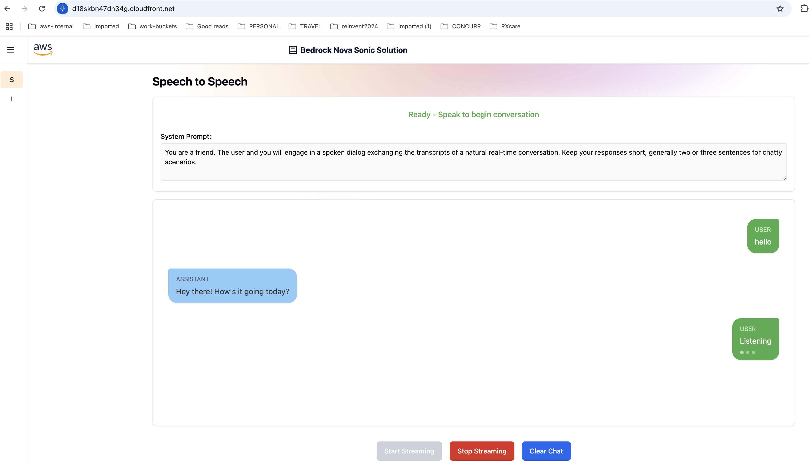

# Nova Sonic Solution Frontend

The frontend application for the Nova Sonic Solution, built with React, TypeScript, and AWS Amplify.

## Application Interface



## Project Structure

```
frontend/
├── src/                    # Source code
│   ├── lib/               # Utility functions and shared code
│   │   └── speech-to-speech/  # WebSocket event management
│   ├── components/        # Reusable UI components
│   ├── pages/            # Page components and routing
│   ├── hooks/            # Custom React hooks
│   ├── types/            # TypeScript type definitions
│   └── styles/           # Global styles and Tailwind config
├── public/               # Static assets
└── images/              # Documentation images
```

## Technology Stack

- **Framework**: React 18 with TypeScript
- **Build Tool**: Vite
- **Styling**: Tailwind CSS
- **UI Components**: 
  - Radix UI primitives
  - Cloudscape Design System
- **Authentication**: AWS Amplify
- **Real-time Communication**: WebSocket
- **Routing**: React Router
- **State Management**: React Hooks
- **PDF Handling**: react-pdf

## Prerequisites

- Node.js 18.x or later
- npm or yarn
- AWS account with appropriate credentials

## AWS Deployment

1. Install dependencies:
   ```
    cd NovaSonicSolution/frontend
   ```

   ```bash
   npm install
   ```

2. Build frontend:
   ```bash
   npm run build
   ```

3. The build output in `dist/` directory will be automatically deployed by the backend CDK stack to S3 and served through CloudFront. The environment variables are automatically configured by the `custom_resource_construct.py` in the CDK stack, which updates the frontend configuration during deployment.

4. Deploy backend stack (see [Backend Build Instructions](../backend/README.md#aws-deployment))

Access the application at `https://$CLOUDFRONT_URL/`

## Local Development

1. Install dependencies (if not already done):
   ```bash
   npm install
   ```

2. Set up local environment:
   ```bash
   # Copy example environment file
   cp .example.env .env
   ```

3. Update environment variables for local development:
   ```env
   VITE_AWS_REGION=<region>
   VITE_COGNITO_USER_POOL_ID=<user-pool-id>
   VITE_COGNITO_CLIENT_ID=<client-id>
   VITE_API_ENDPOINT=http://localhost:8080
   ```

4. Start development server:
   ```bash
   npm run dev
   ```

5. Access the application at `http://localhost:5173`

## Application Testing

### Creating Test Users in Cognito

1. Navigate to AWS Console:
2. Search for "Cognito" in the AWS Console search bar, Click on "Cognito" under Services, Click on "User Pools" in the left navigation.
   Find and click on the User Pool created by the CDK stack (it will have a name containing "NovaSonicSolution").
3. In the User Pool dashboard, click "Users" in the left navigation. Click the "Create user" button and create user with password.

### Testing the Application


1. Go to the application URL - `https://$CLOUDFRONT_URL/` (CloudFront domain from CDK outputs)
2. Click on "Speech to Speech" in the navigation menu.
3. Click the "Start Streaming" button. When prompted, allow access to your microphone.
4. Begin speaking - you should see your speech being transcribed in real-time on the UI
5. The assistant will automatically process your message and respond through speech
6. Click "Stop Streaming" when you're done
   
Note: Ensure your microphone is properly connected and working before testing. The browser may require you to grant microphone permissions the first time you use the feature.

## WebSocket Integration

The WebSocket client is implemented in `src/lib/speech-to-speech/WebSocketEventManager.ts`:

1. **Connection Management**
   - Automatic reconnection
   - Connection state tracking
   - Error handling

2. **Event Handling**
   - Speech data transmission
   - Real-time communication
   - Server status updates

3. **Security**
   - Cognito token authentication
   - Secure WebSocket (WSS) protocol
   - Token refresh handling

## Troubleshooting

1. **Build Issues**
   - Clear npm cache: `npm cache clean --force`
   - Remove node_modules: `rm -rf node_modules`
   - Reinstall dependencies: `npm install`

2. **Runtime Errors**
   - Check browser console logs
   - Verify environment variables
   - Review network requests

3. **WebSocket Issues**
   - Check browser console for connection errors
   - Verify WebSocket URL configuration
   - Ensure valid Cognito tokens
