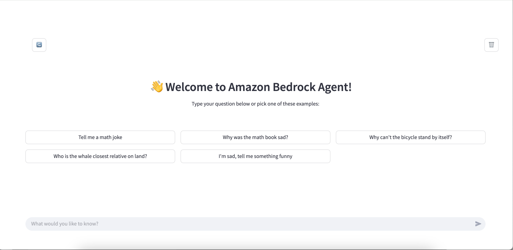
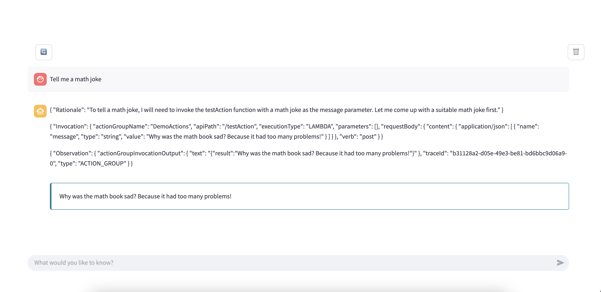
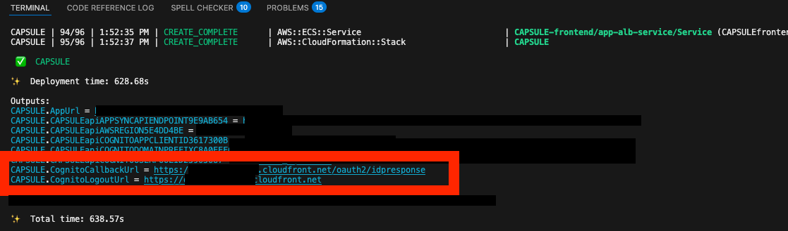
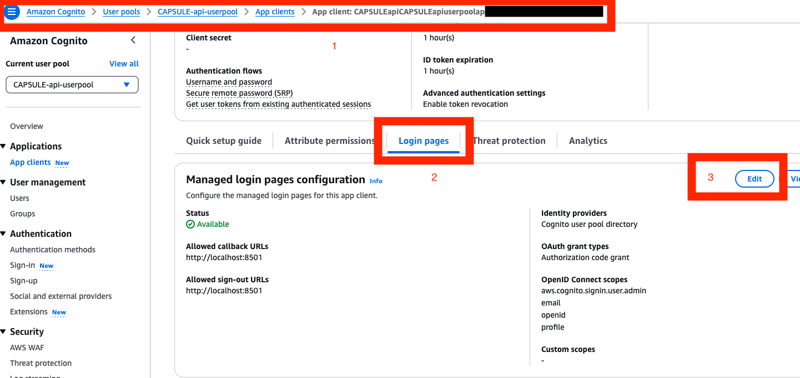
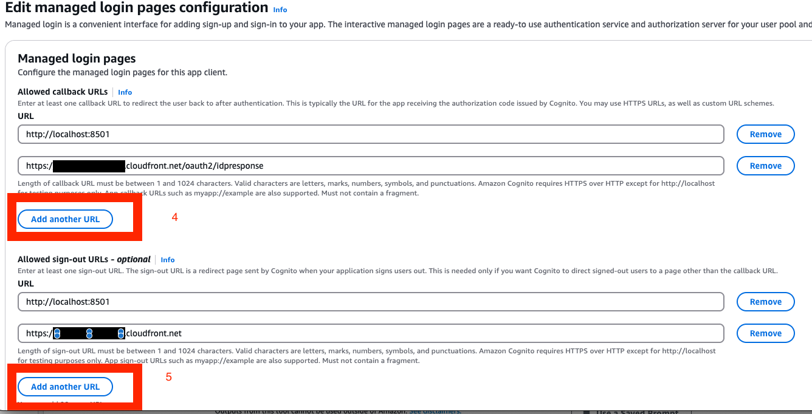

# 📦 Welcome to Capsule!

This is a stack to wrap a Bedrock Agent for simple applications.

- **It provides:**
    - constructs for an API layer between your Bedrock Agent and your Frontend layer
    - frontend layer to jumpstart a simplistic app either hosted locally or on ECS Fargate

Capsule stacks support streaming of the agent traces and authentication with Amazon Cognito




## 🎯 When Should You Use Capsule?

Already have an Amazon Bedrock agent? Capsule helps you transform it into a production-ready chat application with:

- 🔌 **Ready-to-Use API Layer**: Pre-built constructs for seamless communication between Bedrock Agent and frontend
- 🎯 **Flexible Deployment Options**: Run locally or deploy to ECS Fargate with one command
- 🔒 **Built-in Security**: Integrated Amazon Cognito authentication
- 📊 **Real-time Agent Traces**: Built-in streaming support for agent debugging and monitoring
- 🎨 **Customizable UI**: Streamlit-based interface that you can modify to match your needs

Use Capsule when you need to:

1. **Deploy Your Existing Bedrock Agent as a Chat App**: Transform your agent into a secure, production-ready chat interface in minutes
2. **Stream Agent Responses in Real-Time**: Leverage GraphQL subscriptions for WebSocket-style streaming of chat interactions
3. **Secure Your Agent**: Get pre-configured Cognito authentication and API protection out of the box
4. **Debug Agent Behavior**: Built-in agent trace streaming for quick troubleshooting in chat conversations

Perfect for teams who have a Bedrock Agent and want to quickly deploy it as a chat application without dealing with infrastructure setup and API design.

## 💡 Use Case Examples

### Customer Service Bot
Deploy a customer service agent with:
- Custom branding and UI
- Secure authentication for support staff
- Real-time conversation monitoring

### Document Analysis Assistant
Create an AI assistant that:
- Processes uploaded documents
- Provides insights and summaries
- Maintains conversation context

### Internal Knowledge Base Agent
Build a corporate knowledge assistant with:
- Secure access control
- Custom prompt suggestions
- Integration with internal systems


# How to deploy the stack?
This section describes how to build and deploy the application in an AWS account.

## 1. Prerequisites
- **AWS Account:**
    - Make sure you have access to an AWS account and installed the [AWS CLI](https://docs.aws.amazon.com/cli/latest/userguide/getting-started-install.html)
    on your local host.
    - We suggest to configure a named profile to send request to the target account more
    easily: `aws configure --profile [profile-name]`
- **Python**: 
    - This solutions used the Python SDK of the AWS CDK to describe the architecture.
    - Use Python ^3.12
- **The AWS CDK**:
    - The AWS CDK requires a Node.js runtime.
    - [Install](https://docs.aws.amazon.com/cdk/v2/guide/getting_started.html#getting_started_install)
    the AWS CDK using Node Package Manager: `npm install -g aws-cdk`
- **Docker**: 
    - Deploying this CDK application involves building Dockerfiles and
therefore requires a [Finch](https://runfinch.com/docs/managing-finch/macos/installation/) or Docker installed and virtual machine running.

## 2. Clone the repository
Clone the project repository to the location of your choice

## 3. Create, activate and set up the Python virtual environment
Navigate to the project folder and run the following commands (MacOS, Linux)

This project uses [Poetry](https://python-poetry.org/) library for Python packaging
and dependency management. Install Poetry if you don't have it already
```bash
pip install poetry
```

Create and activate the Python virtual environment:
```bash
poetry shell
```

Install project dependencies
```bash
poetry install
```

For information, here are a few useful Poetry commands:

* `poetry add <package-name>` adds a package to [pyproject.toml](pyproject.toml)
and update [poetry.lock](poetry.lock)
* `poetry remove <package-name>` removes a package to [pyproject.toml](pyproject.toml)
and update [poetry.lock](poetry.lock)

Do not manually modify the file `pyproject.toml` if you wish to update the project
dependencies. Refer to Poetry's documentation for the full list of [commands](https://python-poetry.org/docs/cli/).

## 4. Configure the stack
Open the `config.yaml` file located at the project's root. This files gathers the
configuration of the CDK application and therefore of the deployed architecture. 

Modify this file as required:

 * Provide your agent credentials (agent_id and agent_alias_id). If you leave them empty - a "dummy" Bedrock Agent will be created for you for testing purposes
 * Configure UI deployment. If you set `deploy_on_fargate: true` - UI will be hosted on ECS Fargate behind a Cloudfront distribution. Otherwise set `deploy_on_fargate: false`, you will be able to access UI by hosting the streamlit app locally

## 5. Bootstrap the CDK environment
If you never deployed an application in the targeted AWS Region of the selected AWS
account, you first need to initialize ("bootstrap") the environment.

More concretely, when you bootstrap a CDK environment, the CDK will create a few resources
it needs to operate (S3 bucket and ECR repository to store the stack's assets, a few
IAM roles assumed for different tasks, etc.).

Bootstrap your account by running the following command:

```bash
cdk bootstrap --profile [profile-name]
```

## 6. Deploy the CDK application
Since deploying the application involves building Dockerfiles, make sure a Docker/Finch
daemon is running on your host.

Deploy the stack by running the following command:

```bash
cdk deploy --profile [profile-name]
```

## Important: Configuring Cognito URLs for Fargate Deployment

When deploying on Fargate, you need to configure the Cognito authentication URLs. Follow these steps:

### A. Get the URLs from Stack Output
After stack deployment completes, locate and copy two values from the stack outputs:
- `CognitoCallbackUrl`
- `CognitoLogoutUrl`



### B. Navigate to Cognito Settings
In the AWS Console:
1. Go to Amazon Cognito
2. Select the latest `CAPSULE-api-userpool`
3. Click on "App integration" tab
4. Under "App clients", find the Capsule App client
5. Click "Edit"



### C. Update URLs
In the console:
1. Click Add another URL and paste the `CognitoCallbackUrl` into "Allowed callback URLs"
2. Click Add another URL paste the `CognitoLogoutUrl` into "Allowed sign-out URLs"
3. Click "Save changes"



### D. Wait for Changes
Allow 1-2 minutes for the changes to propagate before accessing your app.

> ⚠️ Note: Your app won't authenticate properly until these URLs are configured correctly.


## 7. Try out your app!
Talk with your agent:

* Add your app users to the created Cognito Pool
* If you chose UI deployment on Fargate, go to the `AppUrl` in the stack output parameters
* Alternatively, host streamlit UI locally:
    * Create secrets file for streamlit `streamlit_app/.streamlit/secrets.toml`
    * Fill in secrets with values from the stack output:
    ```bash
    COGNITO-APP-CLIENT-ID = "<YOUR COGNITO APP CLIENT ID>"
    COGNITO-DOMAIN-PREFIX = "<YOUR COGNITO DOMAIN PREFIX>"
    APPSYNC-API-ENDPOINT = "<YOUR APPSYNC API ENDPOINT>"
    AWS-REGION = "<YOUR AWS REGION>"
    REDIRECT_URI = "http://localhost:8501"
    LOGOUT_URI =  "http://localhost:8501"
    ```
    * Run your streamlit app (from the project root folder)
    ```bash
    cd streamlit_app
    streamlit run app.py
    ```

## 8. Configure your app UI
* The starting implementation is very basic in terms of messages formatting. Make sure to add formatting or filtering for the trace messages: adjust `format_messages` method in `streamlit_app/app.py` according to your needs
* In general, change `streamlit_app/app.py` for any UI changes like adding logos, changing prompt suggestions, etc
* If you need to use additional logic in your app, for example, add presigned url generation for retrieved documents - adjust your UI in `streamlit_app/app.py` and add corresponding appsync mutations in `infra/frontend_construct/frontend_fargate_construct.py`
