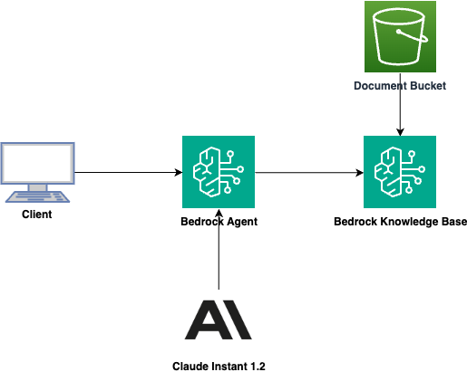

# Amazon Bedrock Agent and Custom Knowledge Base

## Overview

A chat assistant designed to answer questions about literature using RAG from a
selection of books from Project Gutenburg.

This app deploys a Bedrock Agent that can consult a Bedrock Knowledge Base
backed by OpenSearch Serverless as a vector store. An S3 bucket is created to
store the books for the Knowledge Base. The agent also includes a Bedrock Agent
Action Group that provides a function to query the most popular books in Project
Gutenburg.

By providing reusable constructs following AWS best practices, this app helps you quickly build custom generative AI apps on AWS. The constructs abstract complexity of orchestrating AWS services like S3, OpenSearch, Bedrock, etc.

Here is the architecture diagram of the sample application:



## Folder Structure

This sample application codebase is organized into folders : the backend code lives in ```bin/bedrock-agent.ts``` and uses the AWS CDK resources defined in the ```lib``` folder.

The key folders are:

```
samples/bedrock-agent-stack
│
├── bin
│   └── bedrock-agent.ts                      # CDK app
├── lib                                       # CDK Stacks
│   ├── bedrock-agent-stack.ts                # Stack deploying the S3 bucket, Bedrock Agent, Action Group, and Knowledge Base
├── lambda                                    # Lambda functions
│   └── action-group                          # Action Group functions
```

## Getting started

### Prerequisites

- An AWS account. We recommend you deploy this solution in a new account.
- [AWS CLI](https://aws.amazon.com/cli/): configure your credentials

```
aws configure --profile [your-profile] 
AWS Access Key ID [None]: xxxxxx
AWS Secret Access Key [None]:yyyyyyyyyy
Default region name [None]: us-east-1 
Default output format [None]: json
```

- Node.js: v18.12.1
- [AWS CDK](https://github.com/aws/aws-cdk/releases/tag/v2.68.0): 2.68.0
- jq: jq-1.6

### Deploy the solution

This project is built using the [AWS Cloud Development Kit (CDK)](https://aws.amazon.com/cdk/). See [Getting Started With the AWS CDK](https://docs.aws.amazon.com/cdk/v2/guide/getting_started.html) for additional details and prerequisites.

1. Clone this repository.
    ```shell
    git clone <this>
    ```

2. Enter the code sample backend directory.
    ```shell
    cd samples/bedrock-agent
    ```

3. Install packages
   ```shell
   npm install
   ```

4. Boostrap AWS CDK resources on the AWS account.
    ```shell
    cdk bootstrap aws://ACCOUNT_ID/REGION
    ```

5. Enable Access to Amazon Bedrock Models
> You must explicitly enable access to models before they can be used with the Amazon Bedrock service. Please follow these steps in the [Amazon Bedrock User Guide](https://docs.aws.amazon.com/bedrock/latest/userguide/model-access.html) to enable access to the models (```Anthropic::Claude```):.

6. Deploy the sample in your account. 
    ```shell
    $ cdk deploy --all
    ```
The command above will deploy one stack in your account. With the default configuration of this sample, the observed deployment time was ~381 seconds (6.5 minutes).

To protect you against unintended changes that affect your security posture, the AWS CDK Toolkit prompts you to approve security-related changes before deploying them. You will need to answer yes to get all the stack deployed.

Outputs:
```
BedrockAgentStack.AgentId = <AgentID>
BedrockAgentStack.DataSourceId = <DataSourceID>
BedrockAgentStack.DocumentBucket = <DocBucket>
BedrockAgentStack.KnowledgeBaseId = <KBID>
```

6. Load Knowledge Base.
    ```shell
    ./scripts/load-kb.sh s3://<DocBucket>/ <KBID> <DataSourceID>
    ```

### Test

Navigate to the [Bedrock Agents console](https://us-east-1.console.aws.amazon.com/bedrock/home?region=us-east-1#/agents) in your region and find your new agent.

Ask some questions. You may need to tell the agent what book you want to ask about or refresh the session when asking about different books.

#### Example questions

* What are the most popular books in the library?

**Frankenstein**
* What does the Creature want Victor to do?

**Pride and Prejudice**
* Who is Mr. Bingley quite taken with at the ball in Meryton?
* How does Mr. Darcy offend Elizabeth at the first ball?
* Why does Jane’s visit to the Bingleys end up lasting for days?

**Moby Dick**
* What does Ahab nail to the ship’s mast to motivate his crew in his quest for Moby Dick?
* What frightens Ishmael the most about Moby Dick? 

**Romeo and Juliet**
* Why is Romeo exiled?
* Where do Romeo and Juliet meet?


## Clean up

Do not forget to delete the stack to avoid unexpected charges.

First make sure to remove all data from the Amazon Simple Storage Service (Amazon S3) Bucket.

```shell
    $ cdk destroy
```

Delete all the associated logs created by the different services in Amazon CloudWatch logs

# Content Security Legal Disclaimer
The sample code; software libraries; command line tools; proofs of concept; templates; or other related technology (including any of the foregoing that are provided by our personnel) is provided to you as AWS Content under the AWS Customer Agreement, or the relevant written agreement between you and AWS (whichever applies). You should not use this AWS Content in your production accounts, or on production or other critical data. You are responsible for testing, securing, and optimizing the AWS Content, such as sample code, as appropriate for production grade use based on your specific quality control practices and standards. Deploying AWS Content may incur AWS charges for creating or using AWS chargeable resources, such as running Amazon EC2 instances or using Amazon S3 storage.

# Operational Metrics Collection
This solution collects anonymous operational metrics to help AWS improve the quality and features of the solution. Data collection is subject to the AWS Privacy Policy (https://aws.amazon.com/privacy/). To opt out of this feature, simply remove the tag(s) starting with “uksb-” or “SO” from the description(s) in any CloudFormation templates or CDK TemplateOptions.

