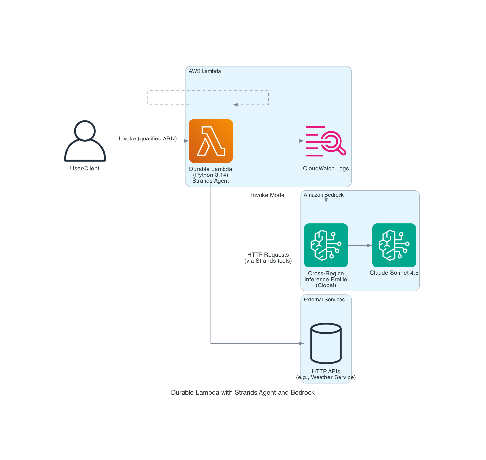

# Strands agents - Lambda durable execution demos

## Overview

This repository contains demos showcasing the [Strands Agents Python SDK](https://strandsagents.com/latest/) integrated with [AWS Lambda durable execution](https://docs.aws.amazon.com/lambda/latest/dg/durable-functions.html).

These samples are for demonstration purpose and not meant for production use.

### Demo 1 : simple weather agent

This demo showcases a weather assistant agent built with the Strands Agents Python SDK and AWS Lambda durable execution. The agent can retrieve and format weather information for locations in the United States using the National Weather Service API.

**Key Features:**

- **Durable Execution**: Uses AWS Lambda durable execution to checkpoint agent state, allowing execution to resume if interrupted
- **Weather API Integration**: Makes HTTP requests to the National Weather Service API to fetch real-time weather data
- **Claude Sonnet 4.5**: Powered by Anthropic's Claude Sonnet 4.5 model via AWS Bedrock Cross-Region Inference Profile
- **Automatic Checkpointing**: Agent execution is automatically checkpointed, ensuring reliability even with long-running operations

**How it works:**

1. The Lambda function receives a prompt (e.g., "What is the weather in Houston?")
2. The agent uses HTTP request tools to query the National Weather Service API
3. The agent processes the weather data and formats it in a human-readable way
4. Execution is checkpointed at each step, allowing recovery from timeouts or failures

**Configuration:**

- Execution timeout: 900 seconds (15 minutes)
- Retention period: 1 day
- Model: Anthropic Claude Sonnet 4.5 via Bedrock Cross-Region Inference Profile
- Runtime: Python 3.14

Here is the architecture diagram of the first demo:



## Folder Structure

This sample application codebase is organized into folders : the backend code lives in ```src/stacks``` and uses the AWS CDK resources defined in the ```src/constructs``` folder.

The key folders are:

```
samples/cdk-lambda-strands-durable
│
│── src
│   ├── constructs      # the constructs used by the stacks      
│   ├── stacks          # the different CDK stacks
├── main.ts
├── lambda              # code for lambda functions
```

## Getting started

> **Warning**
> This sample allows you to interact with models from third party providers. Your use of the third-party generative AI (GAI) models is governed by the terms provided to you by the third-party GAI model providers when you acquired your license to use them (for example, their terms of service, license agreement, acceptable use policy, and privacy policy).

> You are responsible for ensuring that your use of the third-party GAI models comply with the terms governing them, and any laws, rules, regulations, policies, or standards that apply to you.

> You are also responsible for making your own independent assessment of the third-party GAI models that you use, including their outputs and how third-party GAI model providers use any data that might be transmitted to them based on your deployment configuration. AWS does not make any representations, warranties, or guarantees regarding the third-party GAI models, which are “Third-Party Content” under your agreement with AWS. This sample is offered to you as “AWS Content” under your agreement with AWS.

To deploy any of these demos, follow these steps to set up the required tools and configure your AWS environment:

### Prerequisites

- An AWS account. We recommend you deploy this solution in a new account.
- [AWS CLI](https://aws.amazon.com/cli/): configure your credentials

```
aws configure --profile [your-profile] 
AWS Access Key ID [None]: xxxxxx
AWS Secret Access Key [None]:yyyyyyyyyy
Default region name [None]: us-east-1 
Default output format [None]: json
```

- [Node](https://nodejs.org/en) >= v22.0.0
- [AWS CDK](https://github.com/aws/aws-cdk/releases/tag/v2.231.0) >= 2.231.0
- [Projen](https://github.com/projen/projen/releases/tag/v0.98.26) >= 0.98.26
- jq: jq-1.6

You can use the command below to install the dependencies listed above

```
npm install -g npm aws-cdk projen
```

### Deploy the solution

This project is built using the [AWS Cloud Development Kit (CDK)](https://aws.amazon.com/cdk/). See [Getting Started With the AWS CDK](https://docs.aws.amazon.com/cdk/v2/guide/getting_started.html) for additional details and prerequisites.

Lambda durable functions are now available in US East (Ohio) AWS Region (us-east-2). For the latest Region availability, visit the AWS Capabilities by Region page.

1. Clone this repository.

    ```shell
    git clone https://github.com/aws-samples/generative-ai-cdk-constructs-samples.git
    ```

2. Enter the code sample backend directory.

    ```shell
    cd samples/cdk-lambda-strands-durable
    ```

3. Install packages

   ```shell
   projen install
   ```

4. Boostrap AWS CDK resources on the AWS account.

    ```shell
    cdk bootstrap aws://ACCOUNT_ID/REGION
    ```

5. Deploy the sample in your account.

    ```shell
    $ projen deploy --context demo=demo-one
    ```

You can change the value of the context key 'demo' to deploy the chosen demo. If not provided, by default the demo one will be deployed.

### Test

- In the AWS console, navigate to [AWS Lambda](https://us-east-2.console.aws.amazon.com/lambda/home?region=us-east-2#/functions?sb=lastModified&so=DESCENDING) and select the function deployed. You can find the name of the lambda by looking at the CloufFormation outputs.

- Under the Code tab, click ```Test```. Create a new event structured as follows:

```json
{ "prompt": "what's the weather in Seattle ?"}
```

This will send a request to agent, and display the result.

You can invoke the Lambda function with a weather-related prompt using the provided script:

```bash
sh ./invoke-lambda.sh
```

Or manually invoke it with:

```bash
aws lambda invoke \
  --function-name <function-name>:$LATEST \
  --payload '{"prompt": "What is the weather in Seattle?"}' \
  response.json
```

The result of the invocation will be written to a file response.json.

## Clean up

Do not forget to delete the stack to avoid unexpected charges.

```shell
    $ cdk destroy
```

Delete all the associated logs created by the different services in Amazon CloudWatch logs

# Content Security Legal Disclaimer

The sample code; software libraries; command line tools; proofs of concept; templates; or other related technology (including any of the foregoing that are provided by our personnel) is provided to you as AWS Content under the AWS Customer Agreement, or the relevant written agreement between you and AWS (whichever applies). You should not use this AWS Content in your production accounts, or on production or other critical data. You are responsible for testing, securing, and optimizing the AWS Content, such as sample code, as appropriate for production grade use based on your specific quality control practices and standards. Deploying AWS Content may incur AWS charges for creating or using AWS chargeable resources, such as running Amazon EC2 instances or using Amazon S3 storage.
