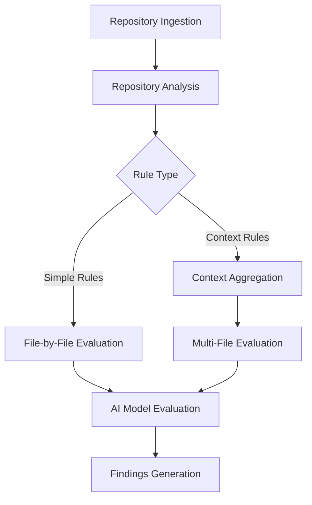
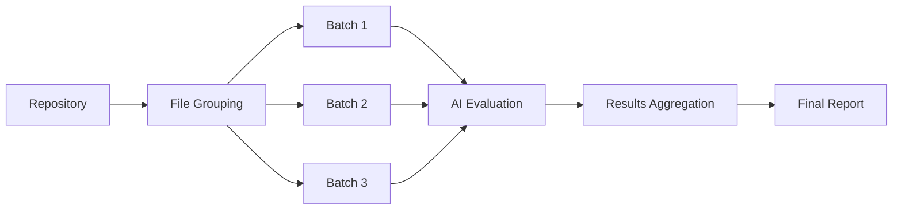
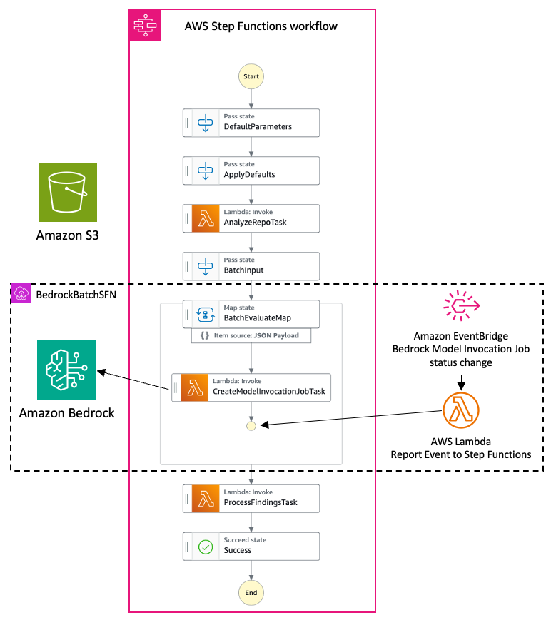
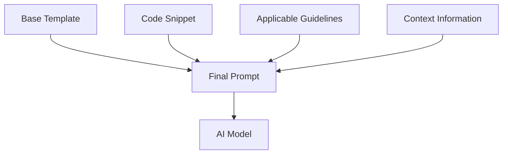
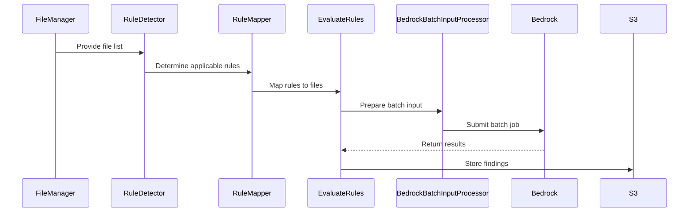

# Technical Details

## Technical Approach

The core methodology of this prototype centers around leveraging large language models (LLMs) to perform intelligent
code analysis. This approach allows for the evaluation of complex, context-dependent guidelines that are challenging to
assess using traditional static analysis tools.

The system's foundation is built on a flexible, JSON-based rule configuration that defines guidelines, their
applicability criteria, and evaluation patterns. This configuration allows for easy management and updating of the
guideline set, ensuring the system can evolve with changing best practices.

Upon receiving a code repository, the prototype begins by analyzing its structure to identify relevant files and
determine which guidelines are applicable based on the project's characteristics. This initial analysis sets the stage
for a more targeted and efficient evaluation process.

One of the key features in this approach is the distinction between "simple" rules that can be evaluated on
individual files and "context" rules that require information from multiple files. This differentiation allows for more
sophisticated guideline evaluations that consider project-wide patterns and structures, going beyond the capabilities of
traditional line-by-line analysis tools.
<figure>

<figcaption>Steps from repository ingestion to rule application</figcaption>
</figure>

At the heart of the code review process is the AI-powered evaluation engine. Leveraging Amazon Bedrock, the prototype
uses advanced language models to assess code against the defined guidelines. This enables the evaluation of nuanced,
semantic aspects of code quality that are difficult to capture with traditional rule-based systems. The AI models'
natural language understanding capabilities allow them to interpret guideline descriptions and apply them to code in a
way that mimics human expert judgment.

To optimize performance and cost-efficiency, the system implements Bedrock batch inference. This allows for parallel
evaluation of multiple files and guidelines, significantly reducing the overall processing time.
<figure>

<figcaption>Batch processing workflow</figcaption>
</figure>

The prototype supports two primary AI models through Amazon Bedrock: Anthropic's Claude 3+ and Amazon's Nova. These
models were chosen for their strong natural language understanding capabilities and their ability to comprehend and
reason about code structures. Importantly, the system is designed with flexibility in mind, allowing for the addition of
new models through a ModelAdapter interface. This extensibility ensures that the prototype can evolve alongside
advancements in AI technology.

During the development process, one of the main challenges faced was balancing the need for comprehensive code analysis
with the practical limitations of AI model context windows. To address this, the system implements a multi-tiered
approach. For simple rules, individual files are evaluated in isolation. For context rules, related
files are included in the prompt to the AI model.

## Architecture Overview

The prototype leverages several AWS services to create a scalable, serverless architecture that can handle code reviews
efficiently and cost-effectively. At the core of the system is Amazon S3, which serves multiple crucial roles. It acts
as the storage solution for input code repositories, allowing development teams to easily submit their projects for
review. Additionally, S3 houses the configuration files that define the guidelines and rules for code evaluation. Once
the review process is complete, S3 also stores the output findings reports, making them readily accessible for further
analysis or integration with other tools.

AWS Lambda functions play a vital role in handling various processing tasks throughout the review pipeline. These
serverless functions are responsible for initial repository analysis, determining which guidelines are applicable to a
given project, and aggregating findings from multiple evaluations. The use of Lambda ensures that the system can scale
seamlessly to handle varying workloads without requiring manual intervention or resource management.

<figure>

<figcaption>Architecture Overview</figcaption>
</figure>
The overall workflow of the code review process is orchestrated by AWS Step Functions. This service manages the
progression from initial input to final report generation, ensuring that each step of the analysis is executed in the
correct order and with proper error handling. Step Functions provide visibility into the status of each review job and
allow for complex workflow logic, such as retries or conditional branches based on intermediate results.

At the heart of the AI-powered code analysis is Amazon Bedrock, which provides access to state-of-the-art language
models. Bedrock allows the system to leverage powerful AI capabilities without the need for managing complex ML
infrastructure, enabling the prototype to focus on its core code review functionality.

The data and process flow within this architecture begins when code repositories are uploaded to the S3 input bucket.
The developer starts a Step Functions workflow, initiating the analysis process. A Lambda function then analyzes the
repository structure to determine which guidelines are applicable based on the project's characteristics. Bedrock batch
inference is then used to perform the AI-based code analysis, applying the selected guidelines to the prepared code
snippets. The results from these AI evaluations are aggregated and processed by Lambda functions, which compile the
findings into a structured format. Finally, a comprehensive findings report is generated and stored in the S3 output
bucket, ready for review by the development team.

This architecture ensures a scalable, efficient, and cost-effective solution for performing expert code reviews across a
wide range of projects and guidelines.

## AI/ML Model Details

The prototype harnesses the power of large language models accessed through Amazon Bedrock to perform sophisticated code
analysis. Currently, the system supports two primary model families: Anthropic's Claude 3+ and Amazon's Nova. These
models were selected for their exceptional natural language understanding capabilities and their ability to comprehend
and reason about complex code structures.

The system's interaction with these models is facilitated through a carefully crafted prompting strategy. This strategy
begins with a base prompt template that sets the stage for the code review task, providing the AI with necessary context
and instructions. For each evaluation, this template is then dynamically populated with the specific code to be
reviewed, the relevant guidelines to evaluate, and any necessary context from other files (particularly important for
context rules). This approach ensures that the AI model has all the information it needs to perform a thorough and
accurate code review.
<figure>

<figcaption>Prompt Construction Process</figcaption>
</figure>

The prompts themselves are engineered with several key objectives in mind. First, they provide clear and unambiguous
instructions on the evaluation task, ensuring that the AI model understands exactly what is expected. Second, they
specify the required format for the output, utilizing a JSON schema to enforce structure and consistency in the AI's
responses. This structured output is crucial for efficient parsing and integration of the AI's findings into the broader
code review system. Finally, the prompts include guidance on how to approach the analysis, encouraging the AI to
consider both compliant and non-compliant aspects of the code. This balanced approach helps ensure a comprehensive
review that not only identifies issues but also recognizes good coding practices.

To accommodate the unique characteristics and capabilities of different AI models, the prototype implements a
ModelAdapter interface. This abstraction layer allows for customized interaction with each supported model, enabling the
system to leverage model-specific features or work around particular limitations. Moreover, this modular design
facilitates the easy addition of new models as they become available, ensuring that the prototype can evolve alongside
advancements in AI technology.

## Rule evaluation sequence

Following is the rule evaluation sequence:

<figure>

<figcaption>Rule evaluation sequence</figcaption>
</figure>