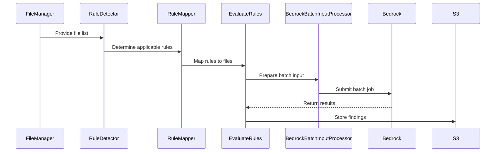

# Code Expert Core Components

This package contains the core implementation components for the Code Expert system, including:

* Business logic for code analysis and rule evaluation
* Lambda function handlers for AWS integration
* Docker task entrypoint for synchronous processing

## Components

### Business Logic

* Rule configuration and parsing
* Repository analysis
* AI model interaction and response processing
* Finding generation

### Lambda Handlers

* analyze_repo.py: Analyzes repository structure and prepares evaluation jobs
* process_findings.py: Processes AI model outputs and generates findings
* bedrock_inference_job_event.py: Handles Bedrock batch job events
* bedrock_create_model_invocation_job.py: Creates Bedrock model invocation jobs

### Docker Task

Provides synchronous processing capability when batch processing is not desired.

## Rule Evaluation Process

The following sequence diagram illustrates the interaction between components during the code review process:
<figure>



<figcaption>Rule evaluation sequence</figcaption>
</figure>

## Testing

Tests are located in the tests/ directory. Run using pytest:

```shell
pytest
``` 

## Note

These components are designed to be deployed using the AWS infrastructure defined in packages/infra. For configuration
and deployment instructions, see the main project documentation.
