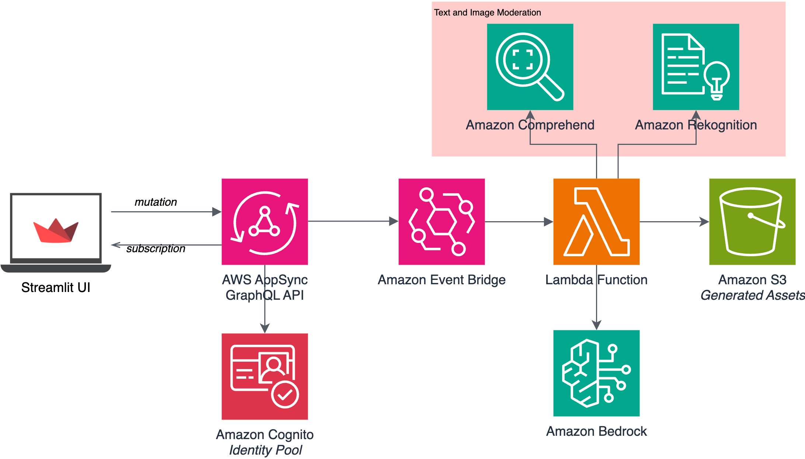

# Content Generation

## Overview

The "Content Generation" sample generative AI application demonstrates how to build end-to-end solutions with generative ai multimodals leveraging AWS services and [AWS Generative AI CDK Constructs](https://github.com/awslabs/generative-ai-cdk-constructs).

The key constructs used in this sample app are:

- [Content Generation](https://github.com/awslabs/generative-ai-cdk-constructs/tree/main/src/patterns/gen-ai/aws-contentgen-appsync-lambda): Generate images from text using Amazon titan-image-generator-v1 or stability.stable-diffusion-xl model.

By wrapping the complexity of orchestrating services like AWS Lambda, Amazon AppSync, and Amazon Bedrock, the Generative AI Constructs library enables you to quickly build custom generative AI applications following AWS best practices. 

Here is the architecture diagram of the sample application:



## Folder Structure

This Content Generation codebase is organized into folders containing the ```frontend``` and ```backend``` infrastructure code. The frontend client app is built with [Streamlit](https://streamlit.io/) and is located in the ```client_app``` folder. The backend code lives in ```bin/content-generation.ts``` and uses the AWS CDK resources defined in the ```lib``` folder.

The key folders are:

```
samples/content-generation
├── client_app                                   # Frontend using Python Streamlit
│   │
│   ├── Home.ts                                  # Sample app entry point
│   ├── assets/                                  # Static files
│   ├── common/                                  # Utility classes
│   ├── graphql/                                 # GraphQL statements and client
│   └── pages/                                   # Streamlit pages 
│
├── bin
│   └── content-generation.ts                     # Backend - CDK app
├── lib                                          # CDK Stacks
│   ├── content-generation-stack.ts                      # VPC resources
│
└── generative-ai-cdk-constructs@0.0.58.jsii.tgz # Local copy of generative-ai CDK constructs
```

## Getting started

To deploy this Sample application, follow these steps to set up the required tools and configure your AWS environment:

### Prerequisites

- An AWS account. We recommend you deploy this solution in a new account.
- [AWS CLI](https://aws.amazon.com/cli/): configure your credentials

```
aws configure --profile [your-profile] 
AWS Access Key ID [None]: xxxxxx
AWS Secret Access Key [None]:yyyyyyyyyy
Default region name [None]: us-east-1 
Default output format [None]: json
```

- Node.js: v18.12.1
- [AWS CDK](https://github.com/aws/aws-cdk/releases/tag/v2.68.0): 2.68.0
- jq: jq-1.6

### Deploy the solution

This project is built using the [AWS Cloud Development Kit (CDK)](https://aws.amazon.com/cdk/). See [Getting Started With the AWS CDK](https://docs.aws.amazon.com/cdk/v2/guide/getting_started.html) for additional details and prerequisites.

1. Clone this repository.
    ```shell
    git clone <this>
    ```

2. Enter the code sample backend directory.
    ```shell
    cd samples/content-generation
    ```

3. Boostrap AWS CDK resources on the AWS account.
    ```shell
    cdk bootstrap aws://ACCOUNT_ID/REGION
    ```

5. Enable Access to Amazon Bedrock Models
> You must explicitly enable access to models before they can be used with the Amazon Bedrock service. Please follow these steps in the [Amazon Bedrock User Guide](https://docs.aws.amazon.com/bedrock/latest/userguide/model-access.html) to enable access to the models (at minimum, ```Amazon titan-image-generator-v1```):.

6. Deploy the sample in your account. 
    ```shell
    $ cdk deploy --all
    ```

The command above will deploy the stack in your account. 


7. Configure client_app
    ```shell
    cd client_app
    python -m venv venv
    source venv/bin/activate
    pip install -r requirements.txt
    ```

8. Still within the /client_app directory, create an ```.env``` file with the following content or mutate the ```.env-example```. Replace the property values with the values retrieved from the stack outputs/console.

```
COGNITO_DOMAIN="<CognitoDomain>"
REGION="<Region>"
USER_POOL_ID="<UserPoolId>"
CLIENT_ID="<ClientId>"
CLIENT_SECRET="COGNITO_CLIENT_SECRET"
IDENTITY_POOL_ID="<IdentityPoolId>"
APP_URI="http://localhost:8501/"
AUTHENTICATED_ROLE_ARN="<AuthenticatedRoleArn>"
GRAPHQL_ENDPOINT = "<GraphQLEndpoint>"
S3_PROCESSED_BUCKET = "<generatedAssetsBucket>"

```

Note: The ```COGNITO_CLIENT_SECRET``` is a secret value that can be retrieved from the AWS Console. Go to the [Amazon Cognito page](https://console.aws.amazon.com/cognito/home) in the AWS console, then select the created user pool. Under App integration, select App client settings. Then, select Show Details and copy the value of the App client secret.

9. Run client_app
    ```shell
    streamlit run Home.py
    ```

### Test

- Create a user in the Cognito user pool. Go to the [Amazon Cognito page](https://console.aws.amazon.com/cognito/home) in the AWS console, then select the created user pool. Under users, select Create user and fill in the form

- Access the webapp (either locally or through the Amplify hosted domain) and sign in using the user credentials you just created 

- Go to Image generation page and enter a text to generate the image. The generated imaged will be displayed on the same page.


### Step 01. Invoke api from AWS AppSync console

```Subscription```
```graphql
subscription MySubscription {
  updateGenerateImageStatus(jobid: "123") {
    filename
    image_path
    input_text
    jobid
    message
    status
  }
}

```

```Mutation```
```graphql
mutation MyMutation {
  updateGenerateImageStatus {
    jobid
    filename
    status
    image_path
    input_text
    message
  }
  generateImage(imageInput: {
    input_text: "bGl6YXJkIGluIHNub3c=",
    jobid: "123",
    model_config: {modelId: "amazon.titan-image-generator-v1", 
      provider: "Bedrock"},
    negative_prompts: ""}) {
    filename
    
    image_path
    input_text
    jobid
    message
    status
  }
}

```


## Clean up

Do not forget to delete the stack to avoid unexpected charges.

First make sure to remove all data from the Amazon Simple Storage Service (Amazon S3) Buckets. Then:

```shell
    $ cdk destroy --all
```

Then in the AWS Console delete the S3 buckets.


# Content Security Legal Disclaimer
The sample code; software libraries; command line tools; proofs of concept; templates; or other related technology (including any of the foregoing that are provided by our personnel) is provided to you as AWS Content under the AWS Customer Agreement, or the relevant written agreement between you and AWS (whichever applies). You should not use this AWS Content in your production accounts, or on production or other critical data. You are responsible for testing, securing, and optimizing the AWS Content, such as sample code, as appropriate for production grade use based on your specific quality control practices and standards. Deploying AWS Content may incur AWS charges for creating or using AWS chargeable resources, such as running Amazon EC2 instances or using Amazon S3 storage.

# Operational Metrics Collection
This solution collects anonymous operational metrics to help AWS improve the quality and features of the solution. Data collection is subject to the AWS Privacy Policy (https://aws.amazon.com/privacy/). To opt out of this feature, simply remove the tag(s) starting with “uksb-” or “SO” from the description(s) in any CloudFormation templates or CDK TemplateOptions.