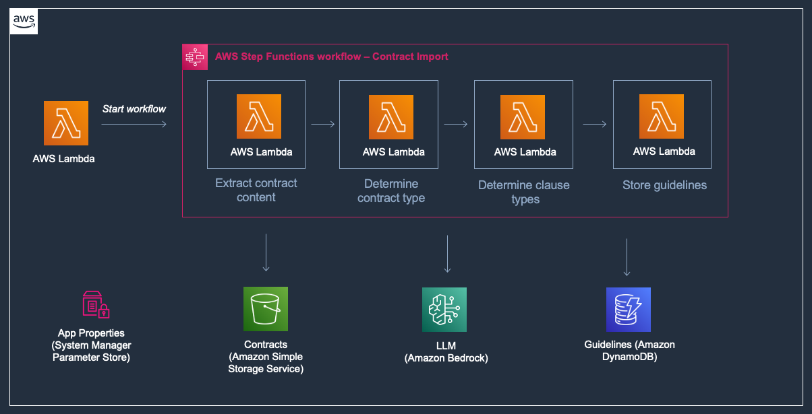

# Contract Compliance Analysis

## Overview

This prototype can potentially help you make your contract compliance process more efficient, leveraging Generative Artificial Intelligence (GenAI) to evaluate contract clauses against predefined guidelines and to provide feedback on adherence to standards applicable to you, based on your instructions.

This prototype is powered by Large Language Models (LLMs) available on Amazon Bedrock, capable of understanding common legal terms and concepts. The LLMs are used to perform advanced natural language tasks like classifying contractual clauses and evaluating whether a particular clauses aligns with predefined guidelines.

**NOTE: Contract Compliance Analysis prototype does not provide legal advice, nor does it serve as a substitute for professional advice. Legal matters may be complex and fact-specific, so you should make your own assessment and consider seeking the advice of a licensed legal profession for any legal matters you encounter.**

## Folder Structure

This sample application codebase is organized into these key folders:

```
samples/contract-compliance-analysis
│
├── backend                                        # Backend
├── frontend                                       # Frontend
```

## Getting started

> **Warning**
> This sample allows you to interact with models from third party providers. Your use of the third-party generative AI (GAI) models is governed by the terms provided to you by the third-party GAI model providers when you acquired your license to use them (for example, their terms of service, license agreement, acceptable use policy, and privacy policy).

> You are responsible for ensuring that your use of the third-party GAI models comply with the terms governing them, and any laws, rules, regulations, policies, or standards that apply to you.

> You are also responsible for making your own independent assessment of the third-party GAI models that you use, including their outputs and how third-party GAI model providers use any data that might be transmitted to them based on your deployment configuration. AWS does not make any representations, warranties, or guarantees regarding the third-party GAI models, which are "Third-Party Content" under your agreement with AWS. This sample is offered to you as "AWS Content" under your agreement with AWS.

To deploy this project, follow the instructions available in the README files located at the **backend** and **frontend** folders, in that sequence.

## Key Features

- **Automated Contract Analysis**: Validates, processes, classifies, and evaluates contract clauses against your guidelines with risk assessment
- **Multi-Language AI Analysis**: Generate analysis reports in English, Spanish, or Portuguese based on user selection
- **Multi-Contract Type Support**: Define and manage multiple contract types (service agreements, employment contracts, etc.) with type-specific guidelines
- **Web Application**: User interface for managing contract types, guidelines, and viewing analysis results
- **AI-Generated Evaluation Questions**: Automatically create compliance questions from guideline definitions
- **Contract Import**: Bootstrap new contract types by extracting guidelines from reference contracts
- **Configurable Risk Thresholds**: Customize risk classification criteria per contract type
- **Flexible Model Selection**: Configure different foundation models for specific tasks via parameter store
- **Optional Legislation Compliance**: AI agent with knowledge base integration for verifying clauses against legal documents


## Architecture

This prototype leverages AWS managed services and Large Language Models to automate contract compliance analysis. The architecture consists of multiple workflows that work together to validate contracts against your guidelines and optionally verify compliance with legislation.

### High-Level Architecture

The system includes serverless workflows for contract processing, a web interface for managing contract types and viewing results, authentication via Amazon Cognito, and storage for contracts, guidelines, and analysis results:


### Guidelines Compliance Workflow

The core workflow processes uploaded contracts through multiple stages: validation, preprocessing (clause extraction), classification (identifying clause types using LLMs), evaluation (checking compliance against guidelines), and risk assessment (calculating overall contract risk):


### Legislation Compliance Workflow (Optional)

When enabled, this workflow uses an AI agent with access to a knowledge base of legislation documents to verify that contract clauses comply with applicable laws and regulations:


### Contract Import Workflow

This workflow uses LLMs to automatically extract contract type information and guidelines from reference contracts, enabling rapid onboarding of new contract types without manual guideline creation:



## Cost Analysis and Pricing

This section analyzes the primary cost drivers for this prototype and demonstrates significant cost savings by using Amazon Nova models compared to Claude models.

### Primary Cost Drivers

**1. Amazon Bedrock** - LLM inference costs for contract processing. Varies based on contract size, guidelines complexity, selected model, and usage volume.

**2. Amazon OpenSearch Serverless (Optional)** - Required only if legislation compliance is deployed. **Minimum cost: ~$350/month** (2 OCUs at ~$0.24/OCU-hour), continuous even when idle.

**3. Other AWS Services** - Step Functions, DynamoDB, Lambda, S3, and API Gateway use pay-per-use pricing. Typically much smaller than Bedrock and OpenSearch costs.

### Bedrock Model Cost Comparison

> **Note**: The following cost estimates are based on actual processing of the **sample contract included with this prototype** using the default guidelines. Your actual costs may vary depending on contract size, guidelines complexity, and usage patterns.

The following analysis shows token usage and costs for processing the included sample contract. Some of the scenarios have [Amazon Bedrock prompt caching](https://docs.aws.amazon.com/bedrock/latest/userguide/prompt-caching.html) enabled.

#### Claude 3.5 Haiku and Amazon Nova Lite
| Model | Input Tokens | Output Tokens | Cache Read Tokens | Cache Write Tokens | **Total Cost** |
|-------|-------------|---------------|-------------------|-------------------|---------------|
| **Claude 3.5 Haiku** | 96,627<br>$0.08 | 38,273<br>$0.15 | 556,512<br>$0.04 | 16,368<br>$0.02 | **$0.29** |
| **Amazon Nova Lite** | 88,024<br>$0.01 | 35,208<br>$0.01 | 567,691<br>$0.01 | 15,343<br>$0.00 | **$0.02** |
| | | | | **Savings:** | **🟢 93%** |

#### Claude 3.5 Sonnet v2 and Amazon Nova Pro (without prompt caching)
| Model | Input Tokens | Output Tokens | **Total Cost** |
|-------|-------------|---------------|---------------|
| **Claude 3.5 Sonnet v2** | 706,407<br>$4.24 | 58,021<br>$1.74 | **$5.98** |
| **Amazon Nova Pro** | 577,291<br>$0.46 | 30,384<br>$0.10 | **$0.56** |
| | | **Savings:** | **🟢 91%** |

#### Claude 3.7 Sonnet and Amazon Nova Premier
| Model | Input Tokens | Output Tokens | Cache Read Tokens | Cache Write Tokens | **Total Cost** |
|-------|-------------|---------------|-------------------|-------------------|---------------|
| **Claude 3.7 Sonnet** | 94,944<br>$0.28 | 80,574<br>$1.21 | 572,880<br>$0.17 | 16,368<br>$0.01 | **$1.67** |
| **Amazon Nova Premier** | 91,076<br>$0.23 | 49,836<br>$0.62 | 529,550<br>$0.33 | 15,575<br>$0.00 | **$1.18** |
| | | | | **Savings:** | **🟢 29%** |

### Pricing Reference

For the most up-to-date pricing information, refer to the [Amazon Bedrock Pricing](https://aws.amazon.com/bedrock/pricing/) page.


## Documentation

For comprehensive information including architecture, security, deployment, and operations, see the [Technical Documentation](./documentation/technical-documentation.adoc).

## Optional: Use Amazon Q Developer CLI Assistant to setup project

For additional setup assistance, you can optionally use Amazon Q Developer CLI, an AI assistant that can help guide you through the deployment process, troubleshoot issues, and answer questions about AWS services.

> **Security Note**: Amazon Q CLI can read files and execute AWS CLI commands. Review all suggested commands before execution, especially those that create, modify, or delete AWS resources. Use in development environments only.

### Installation

Install Amazon Q Developer CLI by following the instructions at: https://docs.aws.amazon.com/amazonq/latest/qdeveloper-ug/command-line-installing.html

### Usage

1. Start the interactive assistant from the project root directory:
   ```bash
   q chat
   ```

2. Ask for help with setup, for example:
   - "Help me set up this contract compliance analysis project"
   - "What are the steps to deploy this application?"   

The assistant will have access to this project's documentation and could help with:
- Step-by-step deployment guidance
- AWS CLI commands and troubleshooting
- Stack output retrieval and frontend configuration
- Cognito user creation

**Important**: Always review and understand commands before executing them. Q CLI will ask for confirmation before making changes to your system or AWS resources.

Type `/quit` to exit the assistant. For more Q CLI options, run `q --help`.

# Content Security Legal Disclaimer
The sample code; software libraries; command line tools; proofs of concept; templates; or other related technology (including any of the foregoing that are provided by our personnel) is provided to you as AWS Content under the AWS Customer Agreement, or the relevant written agreement between you and AWS (whichever applies). You should not use this AWS Content in your production accounts, or on production or other critical data. You are responsible for testing, securing, and optimizing the AWS Content, such as sample code, as appropriate for production grade use based on your specific quality control practices and standards. Deploying AWS Content may incur AWS charges for creating or using AWS chargeable resources, such as running Amazon EC2 instances or using Amazon S3 storage.

# Operational Metrics Collection
Generative AI CDK Constructs samples may collect anonymous operational metrics, including: the region a construct is deployed, the name and version of the construct deployed, and related information. We may use the metrics to maintain, provide, develop, and improve the constructs and AWS services.