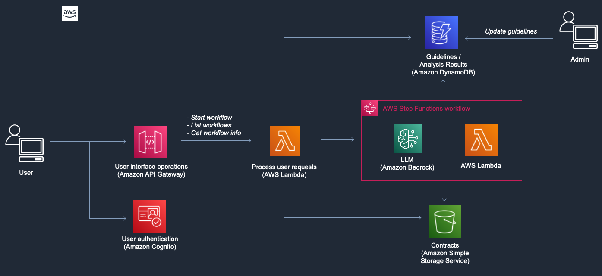
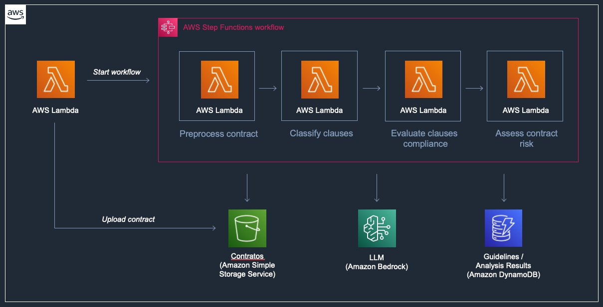

# Contract Compliance Analysis

## Overview

This is a project to automate the compliance analysis of contracts, leveraging Generative Artificial Intelligence (GenAI) to evaluate contract clauses against predefined guidelines and provide feedback on their adherence to the required standards.

The project is powered by Large Language Models (LLM) available on Amazon Bedrock, capable of understanding legal terminology and concepts. LLMs are used to perform advanced natural language tasks, such as clause classification and compliance evaluation according to predefined guidelines.

## Architecture

The core of this solution is the contract analysis workflow, which leverages the Claude Large Language Models to perform advanced natural language tasks to evaluate clauses against predefined guidelines. 
Different storage components are used for the input, intermediate steps, analysis output, and the guidelines information. Additionally, there are components for the user interface, comprising web application hosting, authentication, and integration services.



Zooming in to the contract analysis workflow:



## Cost Analysis and Pricing

This solution demonstrates significant cost savings by using Amazon Nova models compared to traditional Claude models. The following analysis is based on processing the **sample contract included with this solution** using the default guidelines.

### Model Cost Comparison

The following analysis shows token usage and costs for processing the included sample contract. Some of the scenarios have [Amazon Bedrock prompt caching](https://docs.aws.amazon.com/bedrock/latest/userguide/prompt-caching.html) enabled.

#### Claude 3.5 Haiku and Amazon Nova Lite
| Model | Input Tokens | Output Tokens | Cache Read Tokens | Cache Write Tokens | **Total Cost** |
|-------|-------------|---------------|-------------------|-------------------|---------------|
| **Claude 3.5 Haiku** | 98,166<br>$0.08 | 40,570<br>$0.16 | 570,255<br>$0.05 | 16,293<br>$0.02 | **$0.30** |
| **Amazon Nova Lite** | 89,140<br>$0.07 | 45,733<br>$0.11 | 534,275<br>$0.11 | 15,265<br>$0.00 | **$0.02** |
| | | | | **Savings:** | **🟢 92%** |

#### Claude 3.5 Sonnet v2 and Amazon Nova Pro (without prompt caching)
| Model | Input Tokens | Output Tokens | **Total Cost** |
|-------|-------------|---------------|---------------|
| **Claude 3.5 Sonnet v2** | 684,737<br>$2.05 | 65,927<br>$0.99 | **$3.04** |
| **Amazon Nova Pro** | 625,677<br>$0.50 | 33,493<br>$0.11 | **$0.61** |
| | | **Savings:** | **🟢 80%** |

#### Claude 3.7 Sonnet and Amazon Nova Premier
| Model | Input Tokens | Output Tokens | Cache Read Tokens | Cache Write Tokens | **Total Cost** |
|-------|-------------|---------------|-------------------|-------------------|---------------|
| **Claude 3.7 Sonnet** | 98,189<br>$0.29 | 65,927<br>$0.99 | 586,548<br>$0.18 | 16,293<br>$0.06 | **$1.52** |
| **Amazon Nova Premier** | 92,706<br>$0.23 | 53,539<br>$0.69 | 541,100<br>$0.34 | 15,460<br>$0.00 | **$1.26** |
| | | | | **Savings:** | **🟢 17%** |


### Cost Factors

Actual costs depend on several factors:
- **Guidelines complexity**: More detailed guidelines require more tokens
- **Contract size**: Larger contracts consume more input tokens
- **Selected LLM**: Different models have different pricing structures

### Pricing Reference

For the most up-to-date pricing information, refer to the [Amazon Bedrock Pricing](https://aws.amazon.com/bedrock/pricing/) page.

> **Note**: The cost analysis above is based on processing the sample contract included with this solution using the default guidelines. Your actual costs may vary depending on your specific contract sizes, guidelines complexity, and usage patterns.

## Folder Structure

This sample application codebase is organized into these key folders:

```
samples/contract-compliance-analysis
│
├── backend                                        # Backend
├── frontend                                       # Frontend
```

## Getting started

> **Warning**
> This sample allows you to interact with models from third party providers. Your use of the third-party generative AI (GAI) models is governed by the terms provided to you by the third-party GAI model providers when you acquired your license to use them (for example, their terms of service, license agreement, acceptable use policy, and privacy policy).

> You are responsible for ensuring that your use of the third-party GAI models comply with the terms governing them, and any laws, rules, regulations, policies, or standards that apply to you.

> You are also responsible for making your own independent assessment of the third-party GAI models that you use, including their outputs and how third-party GAI model providers use any data that might be transmitted to them based on your deployment configuration. AWS does not make any representations, warranties, or guarantees regarding the third-party GAI models, which are “Third-Party Content” under your agreement with AWS. This sample is offered to you as “AWS Content” under your agreement with AWS.

To deploy this project, follow the instructions available in the README files located at the **backend** and **frontend** folders, in that sequence.


# Content Security Legal Disclaimer
The sample code; software libraries; command line tools; proofs of concept; templates; or other related technology (including any of the foregoing that are provided by our personnel) is provided to you as AWS Content under the AWS Customer Agreement, or the relevant written agreement between you and AWS (whichever applies). You should not use this AWS Content in your production accounts, or on production or other critical data. You are responsible for testing, securing, and optimizing the AWS Content, such as sample code, as appropriate for production grade use based on your specific quality control practices and standards. Deploying AWS Content may incur AWS charges for creating or using AWS chargeable resources, such as running Amazon EC2 instances or using Amazon S3 storage.

# Operational Metrics Collection
Generative AI CDK Constructs samples may collect anonymous operational metrics, including: the region a construct is deployed, the name and version of the construct deployed, and related information. We may use the metrics to maintain, provide, develop, and improve the constructs and AWS services.