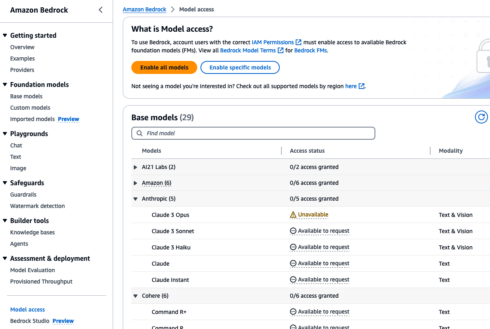

# Contract Compliance Analysis - Back-end

## Table of contents

- [Basic setup](#basic-setup)
    - [Local environment or Cloud9](#local-environment-or-cloud9)
    - [Cloud9 environment (optional)](#cloud9-setup-optional)
    - [Setup steps](#setup-steps)
- [How to customize contract analysis according to your use case](#how-to-customize-contract-analysis-according-to-your-use-case)
- [How to use a different Amazon Bedrock model](#how-to-use-a-different-amazon-bedrock-model)

## Basic setup

### Local environment or Cloud9

You have the option of running the setup from a local workspace or from a Cloud9 environment

In case you opt for Cloud9, you have to setup a Cloud9 environment in the same AWS Account where this Backend will
be installed.

If your local workspace has a non-x86 processor architecture (for instance ARM, like the M processor from Macbooks), it's strongly recommended to perform the setup steps from a Cloud9 environment, to avoid bundling issues of Lambda function dependencies (see [ticket](https://github.com/awslabs/generative-ai-cdk-constructs/issues/541)). Otherwise, set the `DOCKER_DEFAULT_PLATFORM` environmental variable to `linux/amd64` to build `x86_64` packages.

#### Cloud9 setup (optional)

1. Follow the steps on [https://docs.aws.amazon.com/cloud9/latest/user-guide/setting-up.html](https://docs.aws.amazon.com/cloud9/latest/user-guide/setting-up.html)
2. Resize the EBS volume to 40 Gb, by following the steps on [https://docs.aws.amazon.com/cloud9/latest/user-guide/move-environment.html#move-environment-resize](https://docs.aws.amazon.com/cloud9/latest/user-guide/move-environment.html#move-environment-resize)
3. Download the artifacts in the Cloud9 environment
4. Proceed with the steps below

### Setup steps  

In order to deploy this project, you need to have installed:

- [Python](https://www.python.org/downloads/) 3.11 or higher
- [Docker](https://docs.docker.com/engine/install/)
- Git (if using code repository)
- [AWS CDK Toolkit](https://docs.aws.amazon.com/cdk/v2/guide/cli.html)
- [AWS CLI](https://docs.aws.amazon.com/cli/latest/userguide/install-cliv2.html)

With all installed, run this command:

```shell
$ python3 -V && cdk --version && docker info -f "{{.OperatingSystem}}"
Python 3.12.2
2.135.0 (build d46c474)
Docker Desktop
```

An output similar to the above indicates that all is ok to proceed.

If any of these commands fails, you can revisit the documentation and check for possible steps you have forgotten to complete.
Ensure that your CDK version is using CDK V2, by checking if the second line of the output follows the pattern 2.*.*.

Having those installed, it is time to configure your environment to connect to your AWS Account.
To set up your local environment to use such an AWS account you can follow the steps described at [https://docs.aws.amazon.com/cli/latest/userguide/cli-configure-quickstart.html](https://docs.aws.amazon.com/cli/latest/userguide/cli-configure-quickstart.html)

#### Create Python virtual environment

To manually create a virtualenv on MacOS and Linux:

```shell
python3 -m venv .venv
```

After the init process completes and the virtualenv is created, you can use the following
step to activate your virtualenv.

```shell
source .venv/bin/activate
```

If you are a Windows platform, you would activate the virtualenv like this:

```shell
.venv\Scripts\activate.bat
```

Once the virtualenv is activated, you can install the required dependencies.

```shell
pip install -r requirements.txt
```

#### Bootstrap CDK

Run the following

```shell
cdk bootstrap
```

#### Deployment

1. Run AWS CDK Toolkit to deploy the Backend stack with the runtime resources.

    ```shell
    cdk deploy --require-approval=never
    ```

    > Use `DOCKER_DEFAULT_PLATFORM=linux/amd64 cdk deploy --require-approval=never` on macOS

2. Any modifications made to the code can be applied to the deployed stack by running the same command again.

    ```shell
    cdk deploy --require-approval=never
    ```

    > Use `DOCKER_DEFAULT_PLATFORM=linux/amd64 cdk deploy --require-approval=never` on macOS

#### Populate Guidelines table

Once the Stack is setup, you need to populate the DynamoDB Guidelines table with the data from the Guidelines Excel sheet that is included in the `guidelines` folder.

At the `scripts` folder, run the following script to populate the Guidelines table

```shell
python load_guidelines.py  --guidelines_file_path ../guidelines/guidelines_example.xlsx
```

#### Add users to Cognito User Pool

First, locate the Cognito User Pool ID, through the AWS CLI:

```shell
$ aws cloudformation describe-stacks --stack-name MainBackendStack --query "Stacks[0].Outputs[?contains(OutputKey, 'UserPoolId')].OutputValue"

[
    "OutputValue": "<region>_a1aaaA1Aa"
]
```

You can then go the Amazon Cognito page at the AWS Console, search for the User Pool and add users

#### Enable access to Bedrock models

Models are not enabled by default on Amazon Bedrock, so if this is the first time you are going to use Amazon Bedrock, 
it is recommended to first check if the access is already enabled.

Go to the AWS Console, then go to Amazon Bedrock

Click Model access at the left side



Click the **Enable specific models** button and enable the checkbox for Anthropic Claude models

Click **Next** and **Submit** buttons

## How to customize contract analysis according to your use case  

This solution was designed to support analysis of contracts of different types and of different languages, based on the assumption that the contracts establish an agreement between two parties: a given company and another party. The solution already comes pre-configured to analyze service contract contracts in English for the company *AnyCompany*, together with an example of guidelines.

The customization of the contract analysis according to your specific use case basically comprises two major configuration artifacts:

- The App Properties. It's a YAML file that defines the service contract type, the language, the customer name and the role setting for two parties in the agreement. It's passed to scripts under `scripts` folder and to the CloudFormation resources via the `cdk deploy` command. You can either configure the existing *app_properties.yaml* located at the root folder, or you can create a new file - for the latter, you'd need to send an extra parameter to each script/command that depends on the App properties.
- The guidelines. It's an Excel worksheet defining the taxonomy of clause types and how to classify and evaluate the contract clauses. The `guidelines_example.xslx` is your fastest reference defining your guidelines.

The recommended sequence of steps:

1. Customize App Properties.
2. Deploy the Backend stack again.
3. Create a custom guidelines worksheet. Using the example worksheet (`guidelines_example.xslx`) as reference, you can create your own, preserving the same tab/column naming. Apart from what is defined in the example in terms of naming, you can create additional tabs/columns. The content of each column can be in any language that is supported by Anthropic Claude model - just make sure the content language is same as the `language` value defined in the App Properties.
4. Generate evaluation questions for the guidelines. From the `scripts` folder:

    ```shell
    $ python generate_evaluation_questions.py --guidelines_file_path <custom_guidelines_file_path>
    ```

5. Open the resulting `evaluation_questions.xslx` folder and do your own curation. The file content was generated by a Large Language Model as an attempt to produce a set of binary questions (that are answered as 'Yes'/'No') to evaluate the compliance of each contract clause, but that is not authoritative, so you are recommended to go over the results and complement, correct, remove the existing content and also add your own set of binary questions.
6. Bring your curated set of evaluation questions to your custom guidelines worksheet: at the `Taxonomy` tab --> `Evaluation Questions` column
7. Load the custom guidelines into DynamoDB. From the `scripts` folder:

    ```shell
    python load_guidelines.py --guidelines_file_path <custom_guidelines_file_path>
    ```

## How to use a different Amazon Bedrock FM

By default, the application uses Anthropic Claude 3 Haiku v1. Here are steps explaining how to update the model to use. For this example, we will use [Amazon Nova Pro v1](https://aws.amazon.com/blogs/aws/introducing-amazon-nova-frontier-intelligence-and-industry-leading-price-performance/):

- Open the [app_properties.yaml](./app_properties.yaml) file and update the field ```claude_model_id``` to use the model you selected. In this case, we update the field to ```us.amazon.nova-pro-v1:0```. Replace it with the model id you want to use. The list of model ids available through Amazon Bedrock is available in the [documentation](https://docs.aws.amazon.com/bedrock/latest/userguide/models-supported.html). Ensure the model you are selecting is enabled in the Amazon Bedrock -> Model access and available in your region.
- Depending on the model selected, you might need to update some hardcoded values regarding the max number of new tokens generated. For instance, Amazon Nova Pro v1 supports 5000 output tokens, which doesn't require any modifications. However, some models like have a max output tokens of 3000, which requires some changes in the sample. Update the following lines if required:
    - In file [fn-preprocess-contract/index.py](./stack/sfn/preprocessing/fn-preprocess-contract/index.py), update line 96 to change the chunks size to a value smaller than the max tokens output for your model, as well as line 107 to match your model's max output tokens.
    - In file [scripts/utils/llm.py](./scripts/utils/llm.py), update the max tokens output line 28.
    - In file [common-layer/llm.py](./stack/sfn/common-layer/llm.py) update the max tokens output line 30.
    - In file [fn-classify-clauses/index.py](.stack/sfn/classification/fn-classify-clauses/index.py), update line 182 the max tokens output for your model
- Re-deploy the solution as described in previous sections
