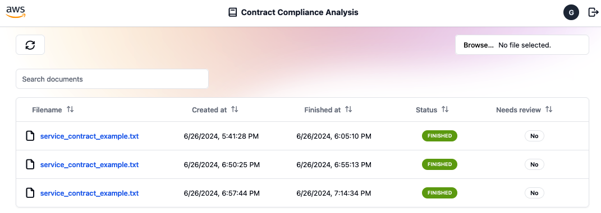

# Contract Compliance Analysis - Frontend

Welcome to the demo frontend application. With this, you'll be able to upload and review contracts processed by the backend application.

## Technologies

- React + Typescript (through Vite)
- Amplify UI (authentication flow)
- TailwindCSS (styling)
- shadcn/ui (custom components)

## Prerequisites

- Node.js and pnpm
- The deployed backend.
- At least one user added on the appropriate Amazon Cognito User Pool (required for authenticated API calls).

## Recommended IDE Extensions

For the best development experience, install these VS Code extensions:

- **Prettier - Code formatter**: Auto-formats code on save
- **Tailwind CSS IntelliSense**: Provides autocomplete, syntax highlighting, and linting for Tailwind CSS

These extensions work together through the configured `prettier-plugin-tailwindcss`, which automatically sorts Tailwind CSS classes in the recommended order for consistency and readability.

## Setup and run

1. After successfully deploying your backend stack, retrieve the required configuration values from CloudFormation outputs:

   ```bash
   aws cloudformation describe-stacks --stack-name MainBackendStack --query "Stacks[0].Outputs[].{OutputKey:OutputKey,OutputValue:OutputValue}" --output yaml
   ```

2. Create a `.env` file by duplicating the included `example.env` and replace the placeholder values with the outputs from step 1.

   ```properties
   VITE_APP_NAME="Contract Compliance Analysis"
   VITE_AWS_REGION="<MainBackendStack.RegionName>"
   VITE_AWS_ACCOUNT_ID="<AWS_ACCOUNT_ID>"
   VITE_COGNITO_USER_POOL_ID="<MainBackendStack.CognitoUserPoolId*>"
   VITE_COGNITO_USER_POOL_CLIENT_ID="<MainBackendStack.CognitoUserPoolClientId*>"
   VITE_COGNITO_IDENTITY_POOL_ID="<MainBackendStack.CognitoIdentityPoolId*>"
   VITE_API_GATEWAY_REST_ENDPOINT="<MainBackendStack.ApiGatewayRestApiEndpoint*>"
   VITE_API_NAME="RestAPI"
   VITE_S3_BUCKET_NAME="<MainBackendStack.ContractBucketName>"
   ```

   **Note**: Output names marked with `*` may have CDK-generated suffixes.

3. Install dependencies:

   ```shell
   $ pnpm install
   ```

4. Start web application
   ```shell
   $ pnpm run dev
   ```

A url like `http://localhost:5173/` (or in another port) will be displayed, so you can open the web application from your browser

## Mock Data for Testing

For development and UI testing, the application includes a comprehensive mock data system. See [`src/test/mockData/README.md`](src/test/mockData/README.md) for complete setup instructions and features.

## How to analyze a contract

Once you open the web application in your browser, click the **New Analysis** button near the top right corner and select a contract file. Supported formats: PDF (.pdf), Word (.doc, .docx), or plain text (.txt).



For ready-to-use examples, refer to the **backend/samples** folder.

Once the file is selected, the contract analysis processing task starts and a new entry is added to the page.

The processing will take a couple of minutes. A click to the refresh button displays the current status of all processing tasks.

## A note on Responsible AI & User Experience Design

You'll see disclaimers like this throughout the application:

> AI can make mistakes. All data should be reviewed before making decisions.

These serve to ensure users understand AI limitations before making compliance-critical business decisions.

This app implements these patterns:

### Semantic Clarity

- **Binary Classification**: "Compliant" / "Non-Compliant"
- **Clear Intent**: All AI outputs require human review regardless of compliance indication

### Disclaimer Placement

- **Home Page**: Footer with policy link
- **Job Analysis**: Info icon tooltip near compliance badge
- **Multilingual**: Available in English, Portuguese, and Spanish

### Design Approach

- **Unobtrusive**: Tooltips with warnings
- **Context-Aware**: Disclaimers appear at decision-critical moments
- **Consistent**: Same messaging and policy link throughout the application

That said, it's your responsibility to ensure you comply with any laws, rules, and regulations applicable to your use of the AI/ML Services as per AWS policies. See [AWS Responsible AI Policy](https://aws.amazon.com/ai/responsible-ai/policy/) for complete details.

## Warning about hosting

It is definitely recommended to perform a thorough security testing, including pen-tests, before hosting this Frontend
application publicly. The work is provided "AS IS" without warranties or conditions of any kind, either express or
implied, including warranties or conditions of merchantability.
