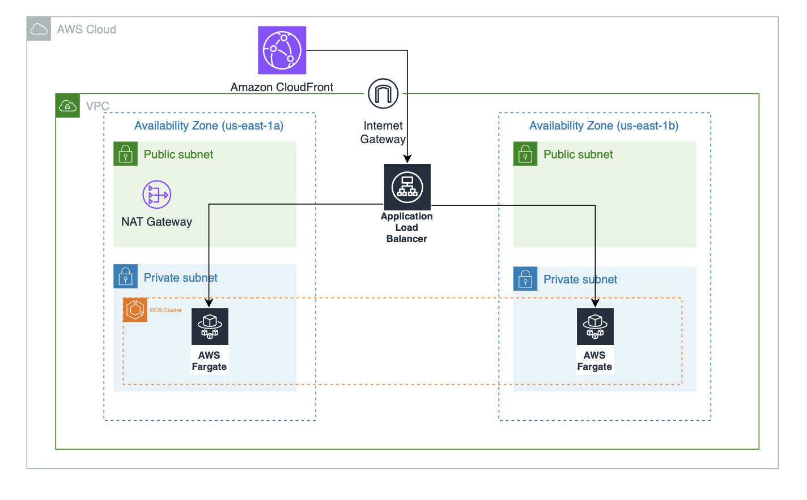
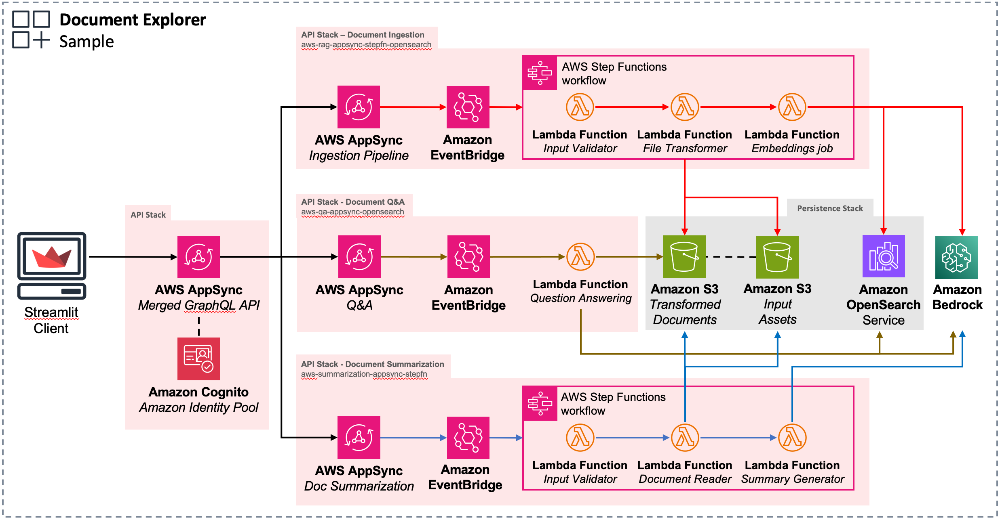

# Document Explorer

## Overview

The "Document Explorer" sample generative AI application demonstrates how to build end-to-end solutions leveraging AWS services and [AWS Generative AI CDK Constructs](https://github.com/awslabs/generative-ai-cdk-constructs).

It includes examples of key components needed in generative AI applications:

- [Data Ingestion Pipeline](https://github.com/awslabs/generative-ai-cdk-constructs/tree/main/src/patterns/gen-ai/aws-rag-appsync-stepfn-opensearch): Ingests documents, converts them to text, and stores them in a knowledge base for retrieval. This enables long context window approaches.

- [Document Summarization](https://github.com/awslabs/generative-ai-cdk-constructs/tree/main/src/patterns/gen-ai/aws-summarization-appsync-stepfn): Summarizes PDF documents leveraging Large Language Models like Anthropic Claude V2 via Amazon Bedrock. 

- [Question Answering](https://github.com/awslabs/generative-ai-cdk-constructs/tree/main/src/patterns/gen-ai/aws-qa-appsync-opensearch): Answers natural language questions by retrieving relevant documents from the knowledge base and leveraging Large Language Models like Anthropic Claude V2 via Amazon Bedrock.

By providing reusable constructs following AWS best practices, this app helps you quickly build custom generative AI apps on AWS. The constructs abstract complexity of orchestrating AWS services like Lambda, OpenSearch, Step Functions, Bedrock, etc.

Here is the architecture diagram of the sample application:

### Front-End Architecture


### Back-End Architecture


### Multiple Document QA Modification
To modify this sample with the ability to perform Question and Answering against multiple source documents, follow the instructions in the Multiple Document QA Modification [README](multi-doc-mod/README.md).

## Folder Structure

This Document Explorer codebase is organized into folders containing the ```frontend``` and ```backend``` infrastructure code. The frontend client app is built with [Streamlit](https://streamlit.io/) and is located in the ```client_app``` folder. The backend code lives in ```bin/document_explorer.ts``` and uses the AWS CDK resources defined in the ```lib``` folder.

The key folders are:

```
samples/document_explorer
├── client_app                                   # Frontend using Python Streamlit
│   │
│   ├── Home.ts                                  # Sample app entry point
│   ├── Dockerfile                               # Sample app Dockerfile
│   ├── assets/                                  # Static files
│   ├── common/                                  # Utility classes
│   ├── graphql/                                 # GraphQL statements and client
│   └── pages/                                   # Streamlit pages for document selection, summarization, and QA
│
├── cdk-config-frontend
│   └── frontend_stack.py                        # Frontend - CDK app
│
├── terraform-config-frontend                    # Frontend – Terraform
│   │
│   ├── main.tf                                  # Terraform resources 
│   ├── outputs.tf                               # Outputs definition
│   ├── variables.tf                             # Variables defintion
│   └── terraform.tfvars                         # Variables values
│
├── terraform-config-backend                    # Backend – Terraform
│   │
│   ├── main.tf                                  # Terraform resources 
│   └── outputs.tf                               # Outputs definition
│
├── bin
│   └── document_explorer.ts                     # Backend - CDK app
├── lib                                          # CDK Stacks
│   ├── networking-stack.ts                      # VPC resources
│   ├── persistence-stack.ts                     # S3 and OpenSearch resources
│   └── api-stack.ts                             # Cognito, AppSync, and generative-ai constructs
│
└── generative-ai-cdk-constructs@0.0.58.jsii.tgz # Local copy of generative-ai CDK constructs
```

## Getting started

To deploy this Document Explorer, follow these steps to set up the required tools and configure your AWS environment:

### Prerequisites

- An AWS account. We recommend you deploy this solution in a new account.
- [AWS CLI](https://aws.amazon.com/cli/): configure your credentials

```
aws configure --profile [your-profile] 
AWS Access Key ID [None]: xxxxxx
AWS Secret Access Key [None]:yyyyyyyyyy
Default region name [None]: us-east-1 
Default output format [None]: json
```

- Node.js: v18.12.1
- [AWS CDK](https://github.com/aws/aws-cdk/releases/tag/v2.68.0): 2.68.0
- jq: jq-1.6
- Clone this repository.
    ```shell
    git clone <this>
    ```
- Enter the code sample backend directory.
    ```shell
    cd samples/document_explorer
    ```
- Install packages
   ```shell
   npm install
   ```
- Enable Access to Amazon Bedrock Models
> You must explicitly enable access to models before they can be used with the Amazon Bedrock service. Please follow these steps in the [Amazon Bedrock User Guide](https://docs.aws.amazon.com/bedrock/latest/userguide/model-access.html) to enable access to the models (at minimum, ```Anthropic::Claude```):.

### Deploy with CDK

<details><summary>CDK Instructions</summary> 

#### Deploy the Backend 

This project is built using the [AWS Cloud Development Kit (CDK)](https://aws.amazon.com/cdk/). See [Getting Started With the AWS CDK](https://docs.aws.amazon.com/cdk/v2/guide/getting_started.html) for additional details and prerequisites.


1. Boostrap AWS CDK resources on the AWS account.
    ```shell
    cdk bootstrap aws://ACCOUNT_ID/REGION
    ```

2. The persistence layer requires the existence of the AWSServiceRoleForAmazonElasticsearchService Service-Linked Role (SLR). The following command checks if the SLR exists and creates one if needed:
    ```shell
    if ! aws iam get-role --role-name AWSServiceRoleForAmazonElasticsearchService > /dev/null 2>&1; then
    aws iam create-service-linked-role --aws-service-name es.amazonaws.com 
    fi
    ```

3. Deploy the sample in your account. 
    ```shell
    $ cdk deploy --all
    ```

The command above will deploy three stacks in your account. Some services require a certain amount of time to get provisioned, here are some values observed:
- Networking stack: ~181s (~3 minutes)
- Persistence stack: ~1137s (~19 minutes)
- Api stack: ~531 seconds (~9 minutes)

Between each stack, to protect you against unintended changes that affect your security posture, the AWS CDK Toolkit prompts you to approve security-related changes before deploying them. You will need to answer yes at each step to get all the stacks deployed.

> **Note**
> If your deployment fails with the message: **MemorySize value failed to satisfy constraint: Member must have value less than or equal to 3008**
then your AWS Account is likely either too new or unused for the region, and there are these choices to fix:
> - [Contact AWS Support](https://support.console.aws.amazon.com/support/home#/)
> - to increase your AWS Lambda maximum memory size limits to 10Gb. This will not happen immediately, but is the recommended option.
> - Deploy the CDK samples with the [optional](https://github.com/awslabs/generative-ai-cdk-constructs/pull/193)
 cdk deploy --all --outputs-file apistack-outputs.json --context maximumLambdaMemorySize=3008 parameter. This method is available without waiting, but will limit functionality and cause unexpected failures when more memory than is available is required.

 ### Deploy the Front End


Note: the CDK Front End deployment was adapted from [this blog](https://kawsaur.medium.com/serverless-streamlit-app-on-aws-with-https-b5e5ff889590).

1. Open the `/cdk-config-frontend` folder
    ```shell
        cd cdk-config-frontend
    ```
2. Configure your environment variables in `client_app/Dockerfile`. Replace the property values with the values retrieved from the stack outputs/console. You will leave `APP_URI` as a placeholder for now because the URI will be the Cloudfront URL output from your Terraform deployment. 

  ```
    ENV COGNITO_DOMAIN = "<ApiStack.CognitoDomain>"
    ENV REGION = "<ApiStack.Region>"
    ENV USER_POOL_ID = "<ApiStack.UserPoolId>"
    ENV CLIENT_ID = "<ApiStack.ClientId>"
    ENV CLIENT_SECRET = "COGNITO_CLIENT_SECRET"
    ENV IDENTITY_POOL_ID = "<ApiStack.IdentityPoolId>"
    ENV AUTHENTICATED_ROLE_ARN = "<ApiStack.AuthenticatedRoleArn>"
    ENV GRAPHQL_ENDPOINT = "<ApiStack.GraphQLEndpoint>"
    ENV S3_INPUT_BUCKET = "<PersistenceStack.InputsAssetsBucket>"
    ENV S3_PROCESSED_BUCKET = "<PersistenceStack.processedAssetsBucket>"
    ENV CLIENT_NAME = "<ApiStack.ClientName>"

  ```
  Note: The ```COGNITO_CLIENT_SECRET``` is a secret value that can be retrieved from the AWS Console. Go to the [Amazon Cognito page](https://console.aws.amazon.com/cognito/home) in the AWS console, then select the created user pool. Under App integration, select App client settings. Then, select Show Details and copy the value of the App client secret.

3. Create a virtual environment and install dependencies by running 
```shell
  python -m venv venv
  source venv/bin/activate
  pip install -r requirements.txt
```
4. Run `cdk bootstrap`
5. Run `cdk deploy`. This can take up to 10-20 minutes. 
6. Now that you have the CloudFront URL, go back to your `client_app/Dockerfile` and paste in the value of your Cloudfront URL like `https://XXXXXXXXXXXXXX.cloudfront.net/` for your APP_URI. Save the Dockerfile and run `cdk deploy` again.
7. Now you have to add your CloudFront URL to your Cognito User Pool App Client. Go to [Amazon Cognito page](https://console.aws.amazon.com/cognito/home), select your user pool. Under the App integration tab, scroll to the bottom of the page and select the name of the App client under `App client list`. In the `Hosted UI` section, select `Edit`. Add your CloudFront URL to the `Allowed callback URLs` list and the `Allowed sign-out URLs` list. Select `Save changes`.  
8. Once your changes have been applied, open your browser to the outputted URL. It may take a few moments for the webapp to become available.

</details>


 ### Deploy with Terraform
 <details><summary>Terraform Instructions</summary> 

 #### Deploy the Backend
 1. Open the `/terraform-config-backend` folder
    ```shell
        cd terraform-config-backend
    ```
 2. Run `terraform init`
 3. Make sure you have Docker running and deploy the Terraform by running `terraform apply`
 4. When prompted with `Do you want to perform these actions?` enter `yes` and wait for the backend to be deployed.


#### Deploy the Front End


1. Open the `/terraform-config-frontend` folder
    ```shell
        cd ../terraform-config-frontend
    ```
2. Configure your environment variables in `client_app/Dockerfile`. Replace the property values with the values the were outputted from the backend Terraform deployment in your terminal. You will leave `APP_URI` as a placeholder for now because the URI will be the Cloudfront URL output from your Front End Terraform deployment. 
  ```
ENV COGNITO_DOMAIN = "<Output.CognitoDomain>"
ENV REGION = "<Output.Region>"
ENV USER_POOL_ID = "<Output.UserPoolId>"
ENV CLIENT_ID = "<Output.ClientId>"
ENV CLIENT_SECRET = "<COGNITO_CLIENT_SECRET>"
ENV IDENTITY_POOL_ID = "<Output.IdentityPoolId>"
ENV AUTHENTICATED_ROLE_ARN = "<Output.AuthenticatedRoleArn>"
ENV GRAPHQL_ENDPOINT = "<Output.GraphQLEndpoint>"
ENV S3_INPUT_BUCKET = "<Output.InputsAssetsBucket>"
ENV S3_PROCESSED_BUCKET = "<Output.ProcessedAssetsBucket>"
ENV CLIENT_NAME = "<Output.ClientName>"
  ```

  Note: The ```COGNITO_CLIENT_SECRET``` is a secret value that can be retrieved from the AWS Console. Go to the [Amazon Cognito page](https://console.aws.amazon.com/cognito/home) in the AWS console, then select the created user pool. Under App integration, select App client settings. Then, select Show Details and copy the value of the App client secret. 


3. Run `terraform init`
4. Run `terraform import aws_cognito_user_pool_client.update_client {user-pool-id}/{client-id}` and make sure to update the `user-pool-id` and `client-id` values. In the `terraform.tfvars` folder, add the values for the `user_pool_id`, `client_name`, `client_id`, `region`.
5. Run `terraform import aws_cognito_identity_pool.update_pool {identity-pool-id}`.
5. Deploy the Terraform by running `terraform apply`
6. Now that you have the CloudFront URL, go back to your `client_app/Dockerfile` and paste in the value of your Cloudfront URL like `https://XXXXXXXXXXXXXX.cloudfront.net/` for your APP_URI. Save the Dockerfile and run `terraform apply` again. 
7. Once your changes have been applied, open your browser to the outputted URL. It may take a few moments for the webapp to become available.
</details>


### Deploy the Front End Locally

<details>
<summary>Local Deployment Instructions</summary>  

1. Configure client_app
    ```shell
    cd client_app
    python -m venv venv
    source venv/bin/activate
    pip install -r requirements.txt
    ```

2. Still within the /client_app directory, create an ```.env``` file with the following content or mutate the ```.env-example```. Replace the property values with the values retrieved from the stack outputs/console.

  ```
COGNITO_DOMAIN="<ApiStack.CognitoDomain>"
REGION="<ApiStack.Region>"
USER_POOL_ID="<ApiStack.UserPoolId>"
CLIENT_ID="<ApiStack.ClientId>"
CLIENT_SECRET="COGNITO_CLIENT_SECRET"
IDENTITY_POOL_ID="<ApiStack.IdentityPoolId>"
APP_URI="http://localhost:8501/"
AUTHENTICATED_ROLE_ARN="<ApiStack.AuthenticatedRoleArn>"
GRAPHQL_ENDPOINT = "<ApiStack.GraphQLEndpoint>"
S3_INPUT_BUCKET = "<PersistenceStack.InputsAssetsBucket>"
S3_PROCESSED_BUCKET = "<PersistenceStack.processedAssetsBucket>"

  ```

Note: The ```COGNITO_CLIENT_SECRET``` is a secret value that can be retrieved from the AWS Console. Go to the [Amazon Cognito page](https://console.aws.amazon.com/cognito/home) in the AWS console, then select the created user pool. Under App integration, select App client settings. Then, select Show Details and copy the value of the App client secret.

3. Run client_app
    ```shell
    streamlit run Home.py
    ```
</details>

### Test

- Create a user in the Cognito user pool. Go to the [Amazon Cognito page](https://console.aws.amazon.com/cognito/home) in the AWS console, then select the created user pool. Under users, select Create user and fill in the form

- Access the webapp (either locally or through the Amplify hosted domain) and sign in using the user credentials you just created 

- Upload sample PDF files to the input bucket. For example, download Amazon's Annual Letters to Shareholders from 1997-2022 from [ir.aboutamazon.com](https://ir.aboutamazon.com/annual-reports-proxies-and-shareholder-letters/default.aspx). Then:

### Step 01. Test document ingestion
`Subscription` *(Optional - to track completion)*
```graphql
subscription UpdateIngestionJobStatus {
  updateIngestionJobStatus(ingestionjobid: "1997-2022") {
    files {
      name
      status
    }
  }
}
```

`Mutation`
```graphql
mutation IngestDocuments {
  ingestDocuments(
    ingestioninput: {
      files: [
        {status: "", name: "1997 Amazon Shareholder Letter.pdf"}, 
        {status: "", name: "1998 Amazon Shareholder Letter.pdf"}, 
        {status: "", name: "1999 Amazon Shareholder Letter.pdf"}, 
        {status: "", name: "2000 Amazon Shareholder Letter.pdf"}, 
        {status: "", name: "2001 Amazon Shareholder Letter.pdf"}, 
        {status: "", name: "2002 Amazon Shareholder Letter.pdf"}, 
        {status: "", name: "2003 Amazon Shareholder Letter.pdf"}, 
        {status: "", name: "2004 Amazon Shareholder Letter.pdf"}, 
        {status: "", name: "2005 Amazon Shareholder Letter.pdf"}, 
        {status: "", name: "2006 Amazon Shareholder Letter.pdf"}, 
        {status: "", name: "2007 Amazon Shareholder Letter.pdf"}, 
        {status: "", name: "2008 Amazon Shareholder Letter.pdf"}, 
        {status: "", name: "2009 Amazon Shareholder Letter.pdf"}, 
        {status: "", name: "2010 Amazon Shareholder Letter.pdf"}, 
        {status: "", name: "2011 Amazon Shareholder Letter.pdf"}, 
        {status: "", name: "2012 Amazon Shareholder Letter.pdf"}, 
        {status: "", name: "2013 Amazon Shareholder Letter.pdf"}, 
        {status: "", name: "2014 Amazon Shareholder Letter.pdf"}, 
        {status: "", name: "2015 Amazon Shareholder Letter.pdf"}, 
        {status: "", name: "2016 Amazon Shareholder Letter.pdf"}, 
        {status: "", name: "2017 Amazon Shareholder Letter.pdf"}, 
        {status: "", name: "2018 Amazon Shareholder Letter.pdf"}, 
        {status: "", name: "2019 Amazon Shareholder Letter.pdf"}, 
        {status: "", name: "2020 Amazon Shareholder Letter.pdf"}, 
        {status: "", name: "2021 Amazon Shareholder Letter.pdf"}, 
        {status: "", name: "2022 Amazon Shareholder Letter.pdf"}, 
      ], 
      ingestionjobid: "1997-2022"}
    ) {
    __typename
  }
}
```

### Step 02. Run summarization
```Subscription```
```graphql
subscription UpdateSummaryJobStatus {
  updateSummaryJobStatus(summary_job_id: "2022_Amazon_Shareholder_Letter") {
    summary_job_id
    files {
      name
      status
      summary
    }
  }
}
```

```Mutation```
```graphql
mutation GenerateSummary {
    generateSummary(summaryInput: {
        summary_job_id: "2022_Amazon_Shareholder_Letter",
        files: [{name: "2022 Amazon Shareholder Letter.txt"}],
    }) {
    __typename
  }
}
```

### Step 03. Ask question
```Subscription```
```graphql
subscription UpdateQAJobStatus {
  updateQAJobStatus(jobid: "11a94ffc-423a-4157-a9c2-892446f9a1fe") {
    question
    answer
    jobstatus
  }
}
```

```Post Question```
```graphql
mutation PostQuestion {
    postQuestion(
        jobid: "11a94ffc-423a-4157-a9c2-892446f9a1fe"
        jobstatus: ""
        filename: "2022 Amazon Shareholder Letter.txt"
        question: "V2hvIGlzIEJlem9zPw=="
        max_docs: 1
        verbose: false
    ) {
    __typename
    }
}
```

## Clean up

Do not forget to delete the stack to avoid unexpected charges.

First make sure to remove all data from the Amazon Simple Storage Service (Amazon S3) Buckets. Then if you deployed with CDK:

```shell
    $ cdk destroy --all
```

Or if you deployed with Terraform: 

```shell
    $ terraform destroy
```

Then in the AWS Console delete the S3 buckets.

## Deployment Options

This application implements search capabilities using Amazon OpenSearch Serverless by default. However, you can configure it to use Amazon OpenSearch Service instead. Review the [developer guide](https://docs.aws.amazon.com/opensearch-service/latest/developerguide/choose-service.html) for help choosing between Serverless and Service.

The key differences when using OpenSearch Service are:

### Networking Stack

- Set `openSearchServiceType` to `'es'` instead of `'aoss'`

### Persistence Stack

- Set `openSearchServiceType` to `'es'` 
- Pass `OpenSearchServiceProps` instead of `OpenSearchServerlessProps`
- Configure domain properties like instance types, number of nodes, storage, etc. 
- Create an OpenSearch domain instead of a collection

### API Stack

- Reference the OpenSearch domain instead of the collection

Here is an example `bin/document_explorer.ts` configured for OpenSearch Service:

```typescript
// ...

//-----------------------------------------------------------------------------
// Networking Layer
//-----------------------------------------------------------------------------
const network = new NetworkingStack(app, 'NetworkingStack', {
  env: env,
  openSearchServiceType: 'es',
});
cdk.Tags.of(network).add("stacl", "network");

//-----------------------------------------------------------------------------
// Persistence Layer
//-----------------------------------------------------------------------------
const persistence = new PersistenceStack(app, 'PersistenceStack', {
  env: env,
  vpc: network.vpc,
  securityGroups: network.securityGroups,
  openSearchServiceType: 'es',
  openSearchProps: {
    masterNodes: 3,
    dataNodes: 3,
    masterNodeInstanceType: 'm6g.large.search',
    dataNodeInstanceType: 'm6g.large.search',
    availabilityZoneCount: 3,
    volumeSize: 20,
  } as OpenSearchServiceProps,
  removalPolicy: cdk.RemovalPolicy.DESTROY  
});
cdk.Tags.of(persistence).add("stack", "persistence");

//-----------------------------------------------------------------------------
// API Layer
//-----------------------------------------------------------------------------
const api = new ApiStack(app, 'ApiStack', {
  env: env,
  description: '(uksb-1tupboc43) API Layer stack',
  existingOpensearchDomain: persistence.opensearchDomain,
  existingVpc: network.vpc,
  existingSecurityGroup: network.securityGroups[0],
  existingInputAssetsBucketObj: persistence.inputAssetsBucket,
  existingProcessedAssetsBucketObj: persistence.processedAssetsBucket,
  openSearchIndexName: 'doc-explorer',
  cacheNodeType: 'cache.r6g.xlarge',
  engine: 'redis',
  numCacheNodes: 1,
  removalPolicy: cdk.RemovalPolicy.DESTROY,
  clientUrl: 'http://localhost:8501/'
});
cdk.Tags.of(api).add("stack", "api");

// ...
```
# Content Security Legal Disclaimer
The sample code; software libraries; command line tools; proofs of concept; templates; or other related technology (including any of the foregoing that are provided by our personnel) is provided to you as AWS Content under the AWS Customer Agreement, or the relevant written agreement between you and AWS (whichever applies). You should not use this AWS Content in your production accounts, or on production or other critical data. You are responsible for testing, securing, and optimizing the AWS Content, such as sample code, as appropriate for production grade use based on your specific quality control practices and standards. Deploying AWS Content may incur AWS charges for creating or using AWS chargeable resources, such as running Amazon EC2 instances or using Amazon S3 storage.

# Operational Metrics Collection
This solution collects anonymous operational metrics to help AWS improve the quality and features of the solution. Data collection is subject to the AWS Privacy Policy (https://aws.amazon.com/privacy/). To opt out of this feature, simply remove the tag(s) starting with “uksb-” or “SO” from the description(s) in any CloudFormation templates or CDK TemplateOptions.
