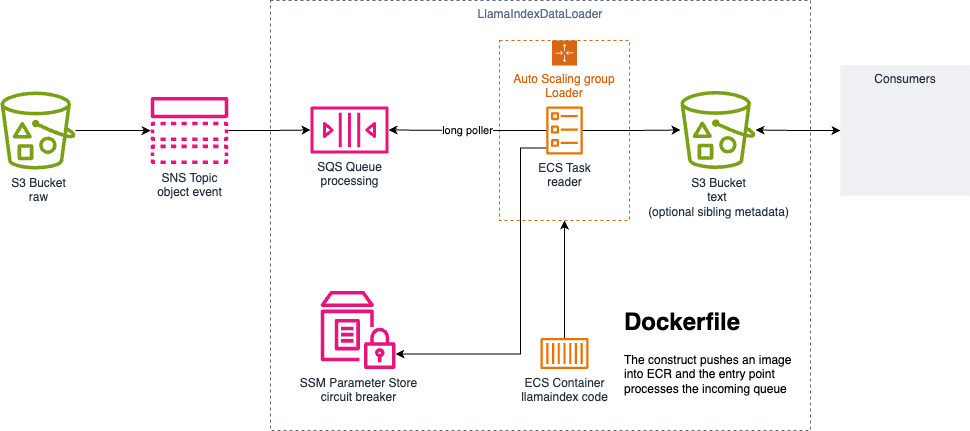

# LlamaIndex Data Loader

This example can be used to sample the `LlamaIndexDataLoader` directly from the [Generative AI CDK Constructs](https://github.com/awslabs/generative-ai-cdk-constructs) package. It demonstrates the [S3 File or Directory Loader](https://github.com/run-llama/llama_index/tree/main/llama-index-integrations/readers/llama-index-readers-s3), and can be extended for other [LlamaHub Readers](https://llamahub.ai/?tab=readers).

_See more information at [LlamaIndex](https://llamaindex.ai/)_

## Overview

When objects are uploaded into the input S3 bucket,
it triggers a topic with a subscribed queue.
The container long polls off the queue
to loads the text and metadata to the output S3 bucket.

To customize for other data readers, create the dependent resources
as well as the logic within a Dockerfile container
for the DockerImageAssetDocker asset to be used.

## Architecture

There are five main resources from the default sample:

1. The "raw" input Amazon S3 bucket
1. The "event" Amazon SNS topic receiving create events from the "raw" bucket
1. The "process" Amazon SQS queue to process each object
1. The "reader" Amazon ECS Fargate task that auto-scales in or out based on the queue's backlog
1. The "output" Amazon S3 bucket to hold each object's [LlamaIndex Document](https://docs.llamaindex.ai/en/stable/module_guides/loading/documents_and_nodes/) with optional metadata



A couple resources are also noted:

* The "circuit breaker" Amazon System Manager Parameter can 'pause' processing the queue
* The "container" Amazon ECR image that runs the code and loads the requirements for the reader

## Setup

This project uses the CDK with Python
and assumes the `python` (or `python3`) executable is
in your path with access to the `venv` package.

### Prerequisites

    - An AWS account. We recommend you deploy this solution in a new account.
    - [AWS CLI](https://aws.amazon.com/cli/): configure your credentials

    ```shell
    aws configure --profile [your-profile]
    AWS Access Key ID [None]: xxxxxx
    AWS Secret Access Key [None]:yyyyyyyyyy
    Default region name [None]: us-east-1
    Default output format [None]: json
    ```

    - Node.js: v18.12.1
    - [AWS CDK](https://github.com/aws/aws-cdk/releases/tag/v2.162.1): 2.162.1

To manually create a virtualenv on MacOS and Linux if it doesn't exist:

    ```bash
    python -m venv .venv
    ```

1. Activate your virtualenv.

        ```bash
        source .venv/bin/activate
        ```

If you are a Windows platform, you would activate the virtualenv like this:

    ```cmd
    .venv\Scripts\activate.bat
    ```

1. Once the virtualenv is activated, you can install the required dependencies.

        ```shell
        pip install -r requirements.txt
        ```

1. At this point you can now synthesize the CloudFormation template for this code.

        ```shell
        cdk synth
        ```

## Test

1. Install the development dependencies if not alreay loaded

        ```shell
        pip install -r requirements-dev.txt
        ```

1. To run the unit tests

        ```shell
        python -m pytest
        ```

## Deploy

1. At this point you can now synthesize the CloudFormation template for this code.

        ```shell
        cdk deploy
        ```

> **NOTE:** building on ARM (like M2 or M3) may require setting extra environmental variables to explicitely use `x86_64` images and packages:
>
    > ```shell
    > BUILDX_NO_DEFAULT_ATTESTATIONS=1 DOCKER_DEFAULT_PLATFORM=linux/amd64 BUILDPLATFORM=linux/amd64 cdk deploy --require-approval=never
    > ```

## Pre-release testing

If using the [Generative AI CDK Constructs](https://github.com/awslabs/generative-ai-cdk-constructs) directly, follow these instructions:

1. Build the Generative AI CDK Constructs library from your repository

        ```shell
        git clone https://github.com/awslabs/generative-ai-cdk-constructs.git
        cd generative-ai-cdk-constructs
        npx projen install && npx projen compile && npx projen package:python
        ```

1. The above outputs the `python` directory within the `dist` folder

> adjust the `requirements.txt` to use the local build instead of the distributed package:

    ```requirements.txt
    # COMMENTED OUT DISTRIBUTED PACKAGE cdklabs.generative-ai-cdk-constructs>=0.1.274
    # For pre-release testing replace with your updated path below:
    cdklabs.generative-ai-cdk-constructs @ file:///home/${USER}/generative-ai-cdk-constructs/dist/python/cdklabs.generative_ai_cdk_constructs-0.0.0-py3-none-any.whl
    ```

1. Uninstall and reinstall

        ```bash
        pip uninstall --yes cdklabs.generative_ai_cdk_constructs
        pip install -r requirements.txt
        ```

1. (Optionally) Check that python loads

        ```python
        >>> from cdklabs.generative_ai_cdk_constructs import ( LlamaIndexDataLoader )
        ```

### Testing the Docker locally

    ```bash
    cd docker
    python3 -m venv .venv
    source .venv/bin/activate
    pip install -r requirements.txt
    # Fill in the `.env` file or pass in on the command line
    $(cat .env | sed -e 's/^/export /g')
    ./runner.sh ./sqs_consumer.py
    ```

### Building on ARM (like M2 or M3)

    ```shell
    BUILDX_NO_DEFAULT_ATTESTATIONS=1 DOCKER_DEFAULT_PLATFORM=linux/amd64 BUILDPLATFORM=linux/amd64 cdk deploy --require-approval=never
    ```

## Excerise

1. Upload object that LlamaIndex's [SimpleDirectoryReader](https://docs.llamaindex.ai/en/stable/module_guides/loading/simpledirectoryreader/#supported-file-types) can read to the "raw" bucket

        ```shell
        aws s3 cp somefile.pdf s3://YOUR_RAW_BUCKET_NAME/
        ```

1. A prefix with the same filename will appear after processing in the "output"

        ```shell
        aws s3 ls s3://YOUR_OUTPUT_BUCKET_NAME/somefile.pdf/
        ```

    _The ECS service tasks may have scaled in to zero if there are no messages in the queue, so it may take up to five minutes for the service to scale out as messages start to arrive_