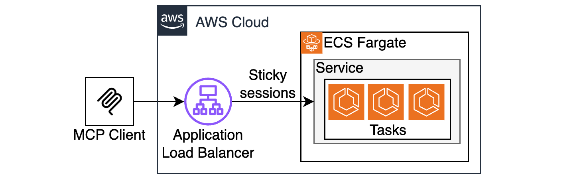

# Stateful MCP Server on ECS Fargate

This is a sample MCP Server running natively on on ECS Fargate and ALB without any extra bridging components or custom transports. This is now possible thanks to the [Streamable HTTP transport](https://modelcontextprotocol.io/specification/2025-03-26/basic/transports#streamable-http) introduced in v2025-03-26.

The solution provides the CDK code to deploy the server on AWS, as well as a sample client to test the deployed server.

The original Terraform version of this sample is available [here](https://github.com/aws-samples/sample-serverless-mcp-servers/tree/main/stateful-mcp-on-ecs-nodejs)

## Overview

MCP Server can run in two modes - stateless and stateful. This repo demonstrates the stateful mode.

Stateful mode implies a persistent SSE connection established between MCP Client and MCP Server. This connection is used for MCP Server to be able to support resumability and proactively send notifications to MCP Clients. This works fine when you have a single instance of MCP Server running (e.g a single ECS Task). This does not work out-of-the-box if you want to have more than one ECS Task since a session will be established with one task, but subsequent requests may hit a different task.

As of building this sample (early May 2025), the TypeScript implementation of MCP Server SDK does not support externalizing session info, meaning session cannot be synchronized across different server instances.

It is possible to address this concern by using ALB with cookie-based sticky sessions, which will insure that requests for a session established with a particular task will always be forwarded to the same task. However, MCP Client SDK does not support cookies by default. To address this concern, this sample injects cookie support into `fetch`, the framework MCP Client uses under-the-hood for HTTP communications (see [mcp_client/index.js](./mcp_client/index.js))

By default, this sample uses the default ALB endpoint, which is HTTP only. See [this](https://github.com/awslabs/aws-solutions-constructs/tree/main/source/patterns/%40aws-solutions-constructs/aws-alb-fargate) to configure the code to use HTTPS.

Only use HTTP for testing purposes ONLY!!! NEVER expose ANYTHING via plain HTTP, always use HTTPS!!!



## Folder Structure

This sample application codebase is organized into folders : the backend code lives in ```bin/mcp-stateful-ecs.ts``` and uses the AWS CDK resources defined in the ```lib``` folder.

The key folders are:

```
samples/mcp-stateful-ecs
│
├── bin
│   └── mcp-stateful-ecs.ts                   # Backend - CDK app
├── lib                                       # CDK Stacks
│   ├── mcp-stateful-ecs-stack.ts             # Stack deploying the resources
├── mcp_client                                # test mcp client to connect to the remote server
├── mcp_server                                # mcp server implementation
```

## Getting started

### Prerequisites

- An AWS account. We recommend you deploy this solution in a new account.
- [AWS CLI](https://aws.amazon.com/cli/): configure your credentials

```
aws configure --profile [your-profile] 
AWS Access Key ID [None]: xxxxxx
AWS Secret Access Key [None]:yyyyyyyyyy
Default region name [None]: us-east-1 
Default output format [None]: json
```

- Node.js: v18.12.1
- [AWS CDK](https://github.com/aws/aws-cdk/releases/tag/v2.114.0): 2.114.0
- jq: jq-1.6

### Deploy the solution

This project is built using the [AWS Cloud Development Kit (CDK)](https://aws.amazon.com/cdk/). See [Getting Started With the AWS CDK](https://docs.aws.amazon.com/cdk/v2/guide/getting_started.html) for additional details and prerequisites.

1. Clone this repository.

    ```shell
    git clone https://github.com/aws-samples/generative-ai-cdk-constructs-samples.git
    ```

2. Enter the code sample backend directory.

    ```shell
    cd samples/mcp-stateful-ecs
    ```

3. Install packages

   ```shell
   npm install
   ```

4. Install the dependencies

    ```shell
   (cd mcp_client && npm install)
   (cd mcp_server && npm install)
   ```

5. Boostrap AWS CDK resources on the AWS account.

    ```shell
    cdk bootstrap aws://ACCOUNT_ID/REGION
    ```

(optional) If needed, update the region in [mcp-stateful-ecs.ts](./bin/mcp-stateful-ecs.ts). Default is `us-east-1`

  ```
  env: {
      region: 'us-east-1'
    },
  ```

6. Deploy the sample in your account.

    ```shell
    $ cdk deploy
    ```

The command above will deploy one stack in your account. With the default configuration of this sample.

To protect you against unintended changes that affect your security posture, the AWS CDK Toolkit prompts you to approve security-related changes before deploying them. You will need to answer yes to get all the stack deployed.

7. Retrieve the value of the CfnOutput related to your remote MCP server endpoint from the stack

    ```shell
    $ aws cloudformation describe-stacks --stack-name McpStatefulEcsStack --query "Stacks[0].Outputs[?contains(OutputKey, 'McpServerEndpoint')].OutputValue"

    [
        "OutputValue": "http://<endpoint>.us-east-1.elb/mcp"
    ]
    ```

8. Export an env variable named `MCP_SERVER_ENDPOINT` with the previous output value

    ```shell
    export MCP_SERVER_ENDPOINT='value'
    ```

### Test your remote MCP Server with MCP client

Use the provided mcp client to test your remote mcp server

```shell
node mcp_client/index.js
```

Observe the response:

```
Connecting ENDPOINT_URL=http://XXXXXXXX.us-east-1.elb/mcp
connected
listTools response:  { tools: [ { name: 'ping', inputSchema: [Object] } ] }
callTool:ping response:  {
  content: [
    {
      type: 'text',
      text: 'pong! taskId=task/McpStatefulEcsStack-AlbToFargateclusterC8F84258-DmTWrC1tlDtl/4bfaa6a6ddc14281b2457fbd70bd5565 v=0.0.11 d=100'
    }
  ]
}
callTool:ping response:  {
  content: [
    {
      type: 'text',
      text: 'pong! taskId=task/McpStatefulEcsStack-AlbToFargateclusterC8F84258-DmTWrC1tlDtl/4bfaa6a6ddc14281b2457fbd70bd5565 v=0.0.11 d=50'
    }
  ]
}
```

## Clean up

Do not forget to delete the stack to avoid unexpected charges.

```shell
    $ cdk destroy
```

Delete associated logs created by the different services in Amazon CloudWatch logs.

## Content Security Legal Disclaimer

The sample code; software libraries; command line tools; proofs of concept; templates; or other related technology (including any of the foregoing that are provided by our personnel) is provided to you as AWS Content under the AWS Customer Agreement, or the relevant written agreement between you and AWS (whichever applies). You should not use this AWS Content in your production accounts, or on production or other critical data. You are responsible for testing, securing, and optimizing the AWS Content, such as sample code, as appropriate for production grade use based on your specific quality control practices and standards. Deploying AWS Content may incur AWS charges for creating or using AWS chargeable resources, such as running Amazon EC2 instances or using Amazon S3 storage.

## Operational Metrics Collection

This solution collects anonymous operational metrics to help AWS improve the quality and features of the solution. Data collection is subject to the AWS Privacy Policy (https://aws.amazon.com/privacy/). To opt out of this feature, simply remove the tag(s) starting with “uksb-” or “SO” from the description(s) in any CloudFormation templates or CDK TemplateOptions.
