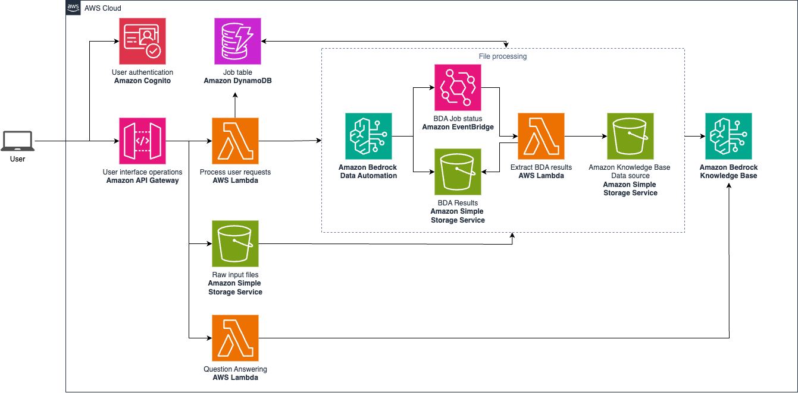

# Bedrock BDA Multimodal Media Solution

## Table of contents

- [Overview](#overview)
- [Architecture](#architecture)
- [Folder structure](#folder-structure)
- [Getting Started](#getting-started)
- [Content Security Legal Disclaimer](#content-security-legal-disclaimer)
- [Service Quotas](#service-quotas)
- [Operational Metrics Collection](#operational-metrics-collection)

## Overview

This demo showcases the Amazon Bedrock multimodal features applied to media and advertising use cases, including [Amazon Bedrock Data Automation](https://aws.amazon.com/bedrock/bda/) (BDA). It highlights several popular media applications, such as BDA for video metadata extraction, BDA for contextual advertising analysis, BDA combined with Bedrock Knowledge Bases for a RAG-based chatbot.

> Warning
>
> Amazon Bedrock Data Automation is currently GA, and is available only in regions us-west-2 and us-east-1. More information available in the 
> [official blog post](https://aws.amazon.com/blogs/machine-learning/simplify-multimodal-generative-ai-with-amazon-bedrock-data-automation/)

- No real personal/sensitive information included
- For testing/development purposes only

## Architecture



Here's the data flow explanation for the AWS architecture above:

- User initiates interaction with the system (for instance, through the provided frontend)
- User authentication via Amazon Cognito is performed, user operations are managed through Amazon API Gateway. Amazon API Gateway forwards requests to AWS Lambda for processing
- When media files are uploaded, an Amazon Bedrock Data Automation (BDA) process is initiated to process the input files. Amazon DynamoDB is used to track operations.
Amazon BDA job status is tracked through Amazon EventBridge. Once completed, an event triggers an AWS Lambda function which parses the output files from BDA and prepares them for Amazon Bedrock Knowledge Base. BDA Results are stored in Amazon S3 (Simple Storage Service).

## Folder Structure

This sample application codebase is organized into these key folders:

```
samples/bedrock-bda-media-solution
│
├── backend             # Backend architecture CDK project
├── images              # Images used for documentation
└── frontend            # Frontend sample application
```

## Getting started

To deploy this project, follow the [instructions available in the `backend` folder](./backend/README.md).

You can also use the provided frontend by following the [instructions available in the `frontend` folder](./frontend/README.md).

## Content Security Legal Disclaimer

The sample code; software libraries; command line tools; proofs of concept; templates; or other related technology (including any of the foregoing that are provided by our personnel) is provided to you as AWS Content under the AWS Customer Agreement, or the relevant written agreement between you and AWS (whichever applies). You should not use this AWS Content in your production accounts, or on production or other critical data. You are responsible for testing, securing, and optimizing the AWS Content, such as sample code, as appropriate for production grade use based on your specific quality control practices and standards. Deploying AWS Content may incur AWS charges for creating or using AWS chargeable resources, such as running Amazon EC2 instances or using Amazon S3 storage.

## Service Quotas

Your AWS account has default quotas, also known as service limits, described [here](https://docs.aws.amazon.com/general/latest/gr/aws_service_limits.html). This sample can be installed and tested within the default quotas for each of the services used. You can request increases for some quotas. Note that not all quotas can be increased.

To operate this sample at scale, it is important to monitor your usage of AWS services and configure alarm settings to notify you when a quota is close to being exceeded. You can find details on visualizing your service quotas and setting alarms [here](https://docs.aws.amazon.com/AmazonCloudWatch/latest/monitoring/CloudWatch-Quotas-Visualize-Alarms.html).

## Operational Metrics Collection

Generative AI CDK Constructs samples may collect anonymous operational metrics, including: the region a construct is deployed, the name and version of the construct deployed, and related information. We may use the metrics to maintain, provide, develop, and improve the constructs and AWS services.