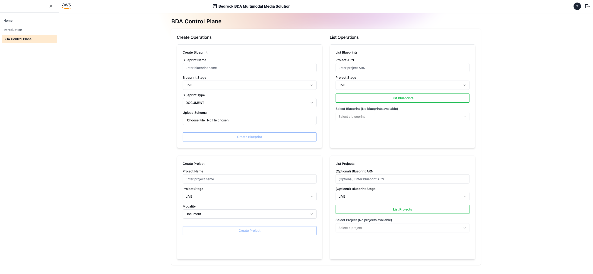
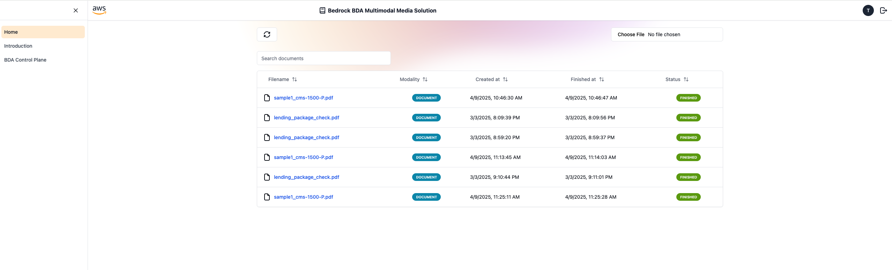
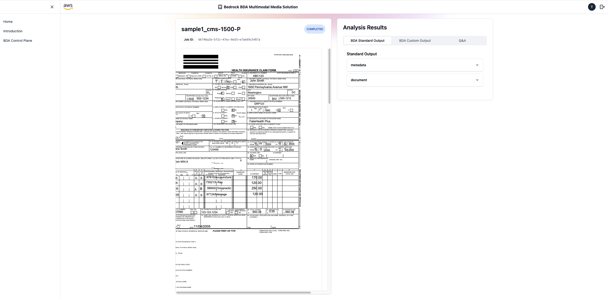
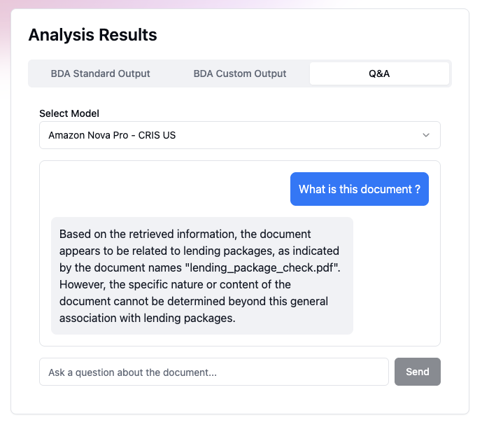
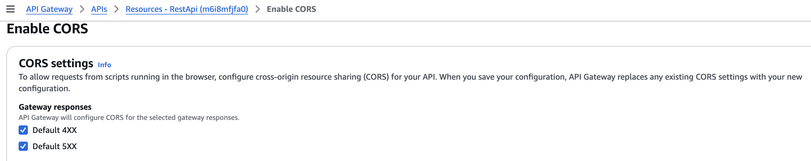

# Bedrock BDA Multimodal Media Solution - Frontend

Welcome to the demo frontend application. With this, you'll be able to upload and review media files processed by the back-end application.

## Table of contents

- [Technologies](#technologies)
- [Prerequisites](#prerequisites)
- [Setup and run](#setup-and-run)
- [Control Plane](#control-plane)
- [How to process a file](#how-to-process-a-file)
- [Warning about hosting](#warning-about-hosting)
- [Troubleshooting](#troubleshooting)
- [APIs](#apis)

## Technologies

- React + Typescript (through Vite)
- Amplify UI (authentication flow)
- TailwindCSS (styling)
- shadcn/ui (custom components)

## Prerequisites

- Node/npm
- The deployed back-end.
- At least one user added on the appropriate Amazon Cognito User Pool (required for authenticated API calls).

## Setup and run

1. If not done already, clone this repository

   ```shell
   git clone https://github.com/aws-samples/generative-ai-cdk-constructs-samples.git
   ```

2. Enter the frontend directory

   ```shell
   cd samples/bedrock-bda-media-solution/frontend
   ```

3. After successfully deploying your back-end stack, you can easily find the information required for the next step by inspecting to Amazon API Gateway and/or Amazon CloudFormation console.

4. Create a `.env` file by duplicating the included `example.env` and replace the property values with the values retrieved from MainBackendStack outputs.

   ```properties
   VITE_REGION_NAME=<BDAMediaSolutionBackendStack.RegionName>
   VITE_COGNITO_USER_POOL_ID=<BDAMediaSolutionBackendStack.CognitoUserPoolId>
   VITE_COGNITO_USER_POOL_CLIENT_ID=<2BDAMediaSolutionBackendStack.CognitoUserPoolClientId>
   VITE_COGNITO_IDENTITY_POOL_ID=<BDAMediaSolutionBackendStack.CognitoIdentityPoolId>
   VITE_API_GATEWAY_REST_API_ENDPOINT=<BDAMediaSolutionBackendStack.ApiGatewayRestApiEndpoint>
   VITE_APP_NAME="Bedrock BDA Multimodal Media Solution"
   VITE_S3_BUCKET_NAME=<BDAMediaSolutionBackendStack.BDAInputBucket>
   ```

   A script is provided if you want to automate the task above. Simply run:

   ```shell
   $ ./generate-dev-env.sh
   ```

5. Install dependencies:

   ```shell
   $ npm install
   ```

6. Start web application
   ```shell
   $ npm run dev
   ```

A url like `http://localhost:5173/` will be displayed, so you can open the web application from your browser

## Login

Begin by logging in with the user profile you created in Cognito.

## Control Plane

To process a file, you must first select a BDA project. You can do this by accessing the Control Plane page, where you can view all existing projects within your account. Additionally, you can create new projects and blueprints from this page if necessary.



After selecting the project to use, choose it from the dropdown list in the 'list projects' operation card. The selected project will be utilized for file processing.

## How to process a file

To begin, go to the home page and click the **Browse** button located near the top right corner. Select a file by clicking on it. A tooltip will appear when you hover over the button, displaying the file requirements supported by BDA.

For ready-to-use sample files, please refer to the [**back-end/samples**](../backend/samples/) folder.

Once the file is selected, the upload and processing task will commence. A new entry will be added to the page, indicating the start of the task.



The processing time will vary depending on the size of the file. You can check the current status of all processing tasks by clicking the refresh button. Once a job is completed, you can click on the file name in the table to access the file details.

## File details

You can access in the job details the BDA output by navigating through the tabs on the right side of the screen. 



The Standard and custom output tabs will provide details on the extracted information from BDA.

The Q&A tab will provide a chatbot to ask questions about the documents processed. You can select an Amazon Bedrock foundation model from the dropdown list and ask a question.



To use this feature, make sure that you enable access to the Amazon Bedrock models you are planning to use, in all required regions:

- For models in the dropdown list marked 'On demand', enable model access in the region you deployed this stack
- For models in the dropdown list marked 'CRIS', enable model access in all regions used by the system defined inference profile (cross regions). For instance, to use 'Amazon Nova Pro - CRIS US', make sure you enable access to the Amazon Nova Pro model in all regions used by this inference profile: US East (Virginia) us-east-1, US West (Oregon) us-west-2, US East (Ohio) us-east-2.

## Warning about hosting

It is definitely recommended to perform a thorough security testing, including pen-tests, before hosting this Frontend 
application publicly. The work is provided “AS IS” without warranties or conditions of any kind, either express or 
implied, including warranties or conditions of merchantability.

## Troubleshooting

### CORS errors in the frontend

In the developer console, if you get an error like ```has been blocked by CORS policy: No 'Access-Control-Allow-Origin' header is present on the requested resource. If an opaque response serves your needs, set the request's mode to 'no-cors' to fetch the resource with CORS disabled.```, go to the Amazon API Gateway console. Click on the created API, and at the root path (/), click on ```enable CORS```. Then, select both fields under ```gateway responses```. Then, click on save.
This will populate response header key:value under Gateway Responses for your API.



### QA response failure

If the chat answers with ```Sorry, I encountered an error while processing your question```, go to the Aws Lambda console. Click on the function with the description ```Answer questions about documents using RAG and Bedrock.```, then under the Monitor tab, click on View CloudWatch logs. This will provide you additional insights on the error. A common issue is missing model access in the different regions used by a cross region inference profile. Please refer to the [File details](#file-details) section for additional details.
