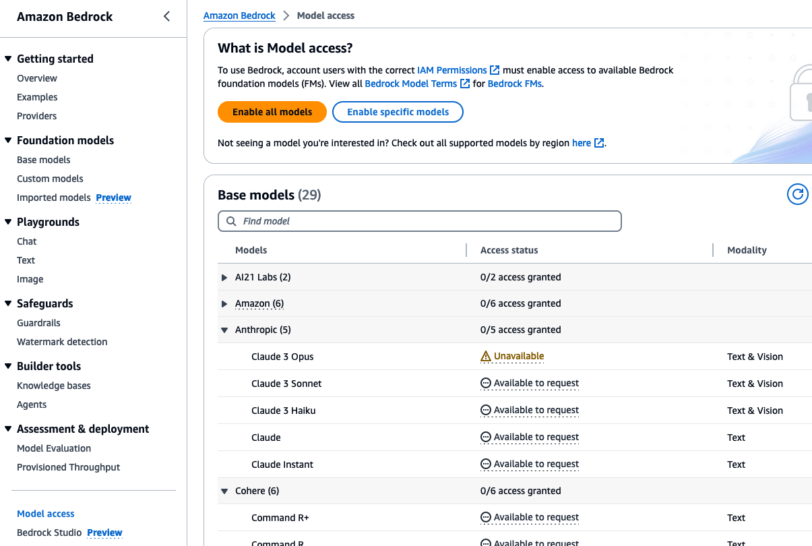
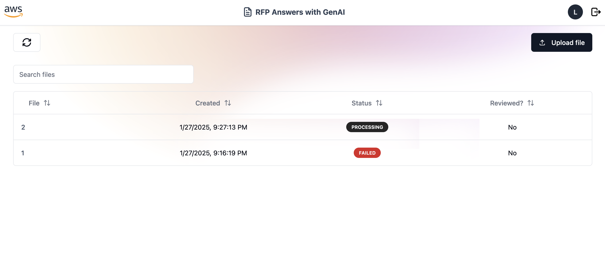
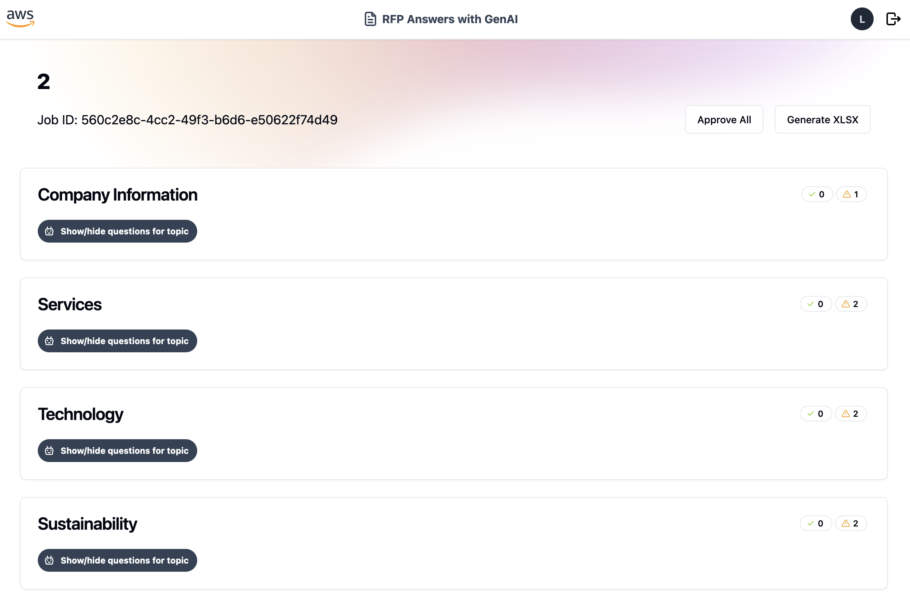
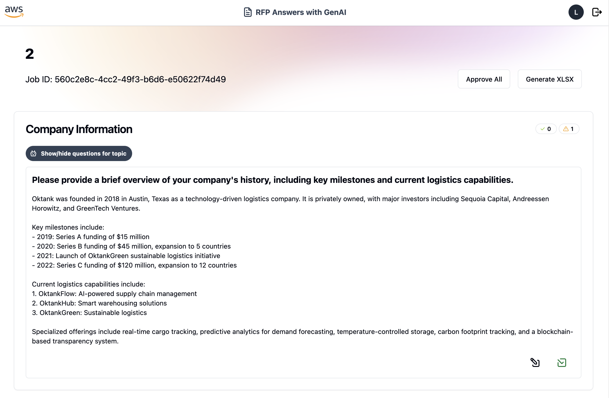
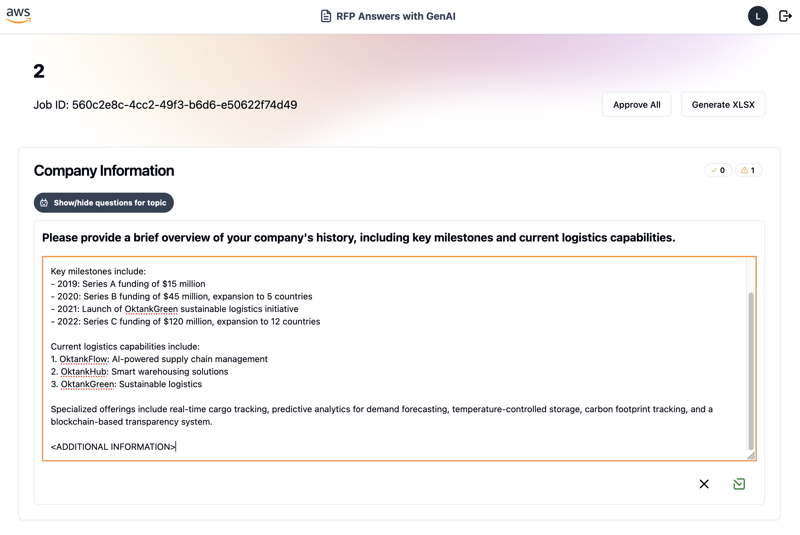
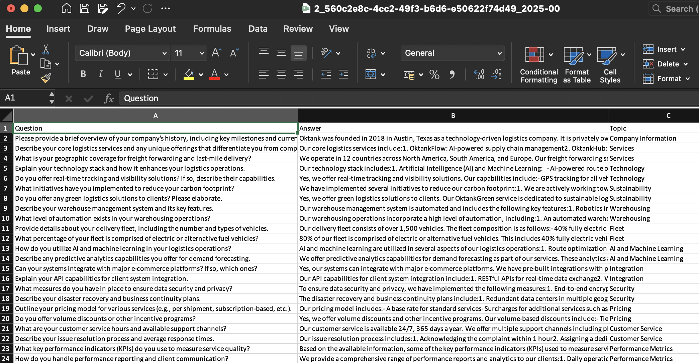

# Usage

## Data

### RFP Files

RFP files are XLSX and/or CSV files containing questions from a merchant requesting information about a service your company is providing. The data doesn't need to be formatted in a specific way. During both ingestion and inference, this project uses Large Language Models (LLMs) to process these files to extract the necessary information used in the solution.

Sometimes RFP files can contain multiple sheets as well as a large number of questions per sheet. This can pose a challenge during file processing: LLMs have a limited output token count, which means if we try to extract too much information at once, some of it can end up getting cut off the model response. Refer to [Anthropic Model Comparison Table](https://docs.anthropic.com/en/docs/about-claude/models#model-comparison-table) for more information on max output tokens.

To avoid this issue, this project divides RFP files in sheets, then in sections inside the sheets. A section is separated by a blank/null line in the sheet. This can be a blank line after a group of questions or after an information topic.

If you feel your RFP files have long blocks of content and wish to avoid information loss, you can insert a blank line between question groups to ensure all of them get processed.

### Supporting documents

Supporting documents are PDF files with company regulations and other relevant information that might need to be used to answer RFP questions. These can be created by converting text documents with protocols and policies, or PPTX presentations with relevant company information. All relevant information will be extracted from the documents and stored into a supporting documentation Knowledge Base.

### Example files

You can find anonymized sample RFP and document files under the `docs/samples` folder.

## Using the solution

### Enable access to Bedrock models

Models are not enabled by default on Amazon Bedrock, so if this is the first time you are going to use Amazon Bedrock, it is recommended to first check if the access is already enabled.

Go to the AWS Console, then use the search bar at the top of the page to go to the Amazon Bedrock console.

Scroll down the left sidebar and, under `Bedrock configurations`, click `Model access`.



Click the **Enable specific models** button and enable the checkbox for Anthropic Claude models

Click **Next** and **Submit** buttons

### Add documents to the Knowledge Base

Once you [deploy the Ingestion stack](../backend/README.md), you will need to add documents to the buckets. 

You can add your existing, previously answered RFPs to the `IngestionBucketFAQ` bucket. You can find out the name of the bucket created by the stack by running:

```shell
$ aws cloudformation describe-stacks --stack-name RFPAnswers-IngestionStack --query "Stacks[0].Outputs[?contains(OutputKey, 'IngestionBucketFAQ')].OutputValue"

[
    "OutputValue": "bucket-name"
]
```

You can add your existing supporting documents to the `IngestionBucketSupportingDocs` bucket. You can find out the name of the created bucket by running:

```shell
$ aws cloudformation describe-stacks --stack-name RFPAnswers-IngestionStack --query "Stacks[0].Outputs[?contains(OutputKey, 'IngestionBucketSupportingDocs')].OutputValue"

[
    "OutputValue": "bucket-name"
]
```

You can bring your own documents, or use the ones provided in the `docs/samples` folder. You can find previously answered RFPs for a ficticious company, **Oktank**, in the `docs/samples/RFPs/answered` folder, and the accompanying supporting PDF documents in the `docs/samples/documents` folder.

### Sync the Knowledge Base

Each time you add, modify, or remove files from the data buckets, you must sync the Knowledge Base data sources so that they are re-indexed to the knowledge base. Syncing is incremental, so Amazon Bedrock only processes added, modified, or deleted documents since the last sync.

To ingest your data into your knowledge base and sync with your latest data:

1. Open the Amazon Bedrock console at https://console.aws.amazon.com/bedrock/

2. From the left navigation pane, select Knowledge base and choose either the FAQ knowledge base or the Docs knowledge base.

3. In the Data source section, select Sync to begin data ingestion or syncing your documents. To stop a data source currently syncing, select Stop. A data source must be currently syncing in order to stop syncing the data source. You can select Sync again to ingest the rest of your data.

4. When data ingestion completes, a green success banner appears if it is successful.

You can choose a data source to view its Sync history. Select View warnings to see why a data ingestion job failed.

### Add users to Cognito User Pool

If you wish to use the provided sample API, you must first create a Cognito user so that you can authenticate your API requests.

To create an user, locate the Cognito User Pool ID using the AWS CLI:

```shell
$ aws cloudformation describe-stacks --stack-name RFPAnswers-InferenceStack --query "Stacks[0].Outputs[?contains(OutputKey, 'UserPoolId')].OutputValue"

[
    "OutputValue": "<region>_a1aaaA1Aa"
]
```

You can then go the Amazon Cognito page at the AWS Console, search for the User Pool and add users.

### Interact with the application

You can use the sample User Interface provided in the `frontend` folder as an example of how to interact with this application.

> We do not recommend having this web application in production or publicly accessible as-is. The user interface was created for demo purposes only. The work is provided **AS IS** without warranties or conditions of any kind, either express or implied, including warranties or conditions of merchantability. You bear the risks of using the package.

The application allows the user to process their own RFP files, view existing processing jobs for RFPs, and interact with answers generated by the LLM. 

You can bring your own RFP files, or, like in the ingestion process, use the ones provided in the `docs/samples` folder. You can find non-answered RFPs for the ficticious **Oktank** company in the `docs/samples/RFPs/only_questions` folder.



The first screen of the application consists of a table containing all files already processed. You can process a file multiple times. The table contains the status of the file processing job (whether it's running, it has succeeded or failed), the status of the review (if the RFP has been approved or not) and the date it was processed. 

For the scope of this solution, you cannot delete a job from the user interface. You can implement your own endpoint for that or manually delete all job instances from the DynamoDB table. 





By clicking a table entry, you will be redirected to the job edition screen. Answers generated by the LLM will be separated by topic. 



They can be edited (simple text edition) and approved. You can mass approve all answers by clicking the `Aprove RFP` button. This will change the status of the RFP in the first screen.



At any point, you can generate a XLSX file that contains all questions, respective topics, and answers generated by the LLM.

## Customizing the solution

### LLM Prompts

This solution includes prompts tested with a few types of RFP, mainly for contract providers. They were created using [Anthropic's Prompt Engineering best practices](https://docs.anthropic.com/en/docs/build-with-claude/prompt-engineering/overview). We encourage you to customize the prompts and try out other techniques that might tailor to your use case:

- You can find the ingestion/question extraction prompt at `backend/stack/lambdas/shared/processor.py`
- You can find the question-answering prompt at `backend/stack/lambdas/answer_question_fn/app/definitions.py`

### Using other LLMs

This solution is configured to use Anthropic Claude 3.5 Sonnet v1. Should you wish to try out other models to see how they perform for your specific use case, you can follow these steps to update the model.

**Ingestion**

1. Open file `backend/stack/ingestion_stack.py`. On `line 161`, update the resource permissions to the model you wish to use. The list of model ids available through Amazon Bedrock is available in the [Bedrock documentation](https://docs.aws.amazon.com/bedrock/latest/userguide/models-supported.html).

2. Open file `backend/stack/lambdas/custom_chunking_handler_fn/app/handler.py`. On `line 29`, substitute the value for `MODEL_ID` for the model ID you wish to use.

**Inference**

1. Open file `backend/stack/stack_constructs/sfn_step_answer_question.py`. On `line 69`, update the resource permissions to the model you wish to use. The list of model ids available through Amazon Bedrock is available in the [Bedrock documentation](https://docs.aws.amazon.com/bedrock/latest/userguide/models-supported.html).

2. Open file `backend/stack/lambdas/answer_question_fn/app/chain.py`. On `line 28`, substitute the value for `BEDROCK_MODEL_ID` for the model ID you wish to use.

### Filtering context by date

This solution allows you to provide a date for documents during the ingestion process. You can use this information to filter old, outdated documents during the Context Retrieval step when generating RFP answers.

To provide a date for the RFP, you will need to add a metadata document alongside the CSV or XLSX document you will upload into the `FAQBucket`. You can refer to page [Include metadata in a data source to improve knowledge base query](https://docs.aws.amazon.com/bedrock/latest/userguide/kb-metadata.html) for more information on how to create the metadata document.

Once you have indexed this metadata, you can open file `backend/stack/lambdas/answer_question_fn/app/context.py`. On `line 54`, you can change the `retrieval_config` dictionary to filter older dates. For more information on how to configure filters, please refer to https://docs.aws.amazon.com/bedrock/latest/userguide/kb-test-config.html