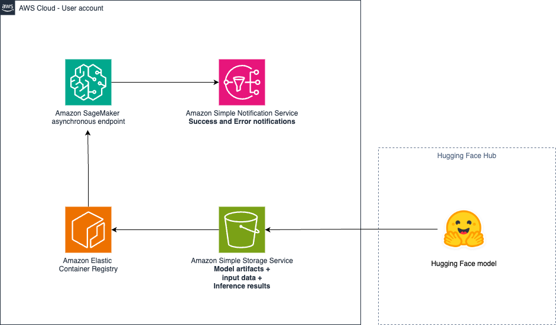

# SageMaker custom Hugging Face model deployment (SVD)

## Overview

The "SageMaker custom Hugging Face model deployment svd" sample generative AI application demonstrates how to deploy and interact with a multimodal model where artifacts are stored in an Amazon Simple Storage Service (S3) bucket, leveraging AWS services and [AWS Generative AI CDK Constructs](https://github.com/awslabs/generative-ai-cdk-constructs).

Specifically, this sample deploys an SageMaker async endpoint, hosting [stable-video-diffusion-img2vid-xt-1-1](https://huggingface.co/stabilityai/stable-video-diffusion-img2vid-xt-1-1). Stable Video Diffusion (SVD) 1.1 Image-to-Video is a diffusion model that takes in a still image as a conditioning frame, and generates a video from it. The sample also provides a CLI tool to test the endpoint.

Please note: For commercial use, please refer to https://stability.ai/license. 

By providing reusable constructs following AWS best practices, this app helps you quickly build custom generative AI apps on AWS.

Thanks to @kellan-cartledge for co-authoring this sample

Here is the architecture diagram of the sample application:



## Folder Structure

This sample application codebase is organized into folders : the backend code lives in ```bin/sagemaker_huggingface_model_svd.ts``` and uses the AWS CDK resources defined in the ```lib``` folder.

The key folders are:

```
samples/sagemaker_huggingface_model_svd
│
├── bin
│   └── sagemaker_huggingface_model_svd.ts             # Backend - CDK app
├── lib                                                  # CDK Stacks
│   ├── sagemaker_huggingface_model_svd-stack.ts       # Stack deploying the AWS Lambda function and SageMaker async endpoint
├── model_preparation                                    # Notebooks
│   ├── svd.ipynb                                      # Model preparation notebook
```

## Getting started

> **Warning**
> Warning This sample allows you to interact with models from third party providers. Your use of the third-party generative AI (GAI) models is governed by the terms provided to you by the third-party GAI model providers when you acquired your license to use them (for example, their terms of service, license agreement, acceptable use policy, and privacy policy).

> You are responsible for ensuring that your use of the third-party GAI models comply with the terms governing them, and any laws, rules, regulations, policies, or standards that apply to you.

> You are also responsible for making your own independent assessment of the third-party GAI models that you use, including their outputs and how third-party GAI model providers use any data that might be transmitted to them based on your deployment configuration. AWS does not make any representations, warranties, or guarantees regarding the third-party GAI models, which are “Third-Party Content” under your agreement with AWS. This sample is offered to you as “AWS Content” under your agreement with AWS.

### Prepare your model

First, you need to prepare the model and store it in Amazon S3. For this, you can use the [notebook](./model_preparation/svd.ipynb) provided, along with the [README](./model_preparation/README.md) file. The notebook contains all the details to understand the process and save the model artifacts in S3. Save the location where your model artifacts are saved.

> Note
> This sample was tested in the region us-east-1. The Amazon S3 bucket containing your model artifacts needs to be in the same region where your async endpoint is deployed.

To deploy this sample application, follow these steps to set up the required tools and configure your AWS environment:

### Prerequisites

- An AWS account. We recommend you deploy this solution in a new account.
- [AWS CLI](https://aws.amazon.com/cli/): configure your credentials

```
aws configure --profile [your-profile] 
AWS Access Key ID [None]: xxxxxx
AWS Secret Access Key [None]:yyyyyyyyyy
Default region name [None]: us-east-1 
Default output format [None]: json
```

- Node.js: v18.12.1
- [AWS CDK](https://github.com/aws/aws-cdk/releases/tag/v2.149.0): 2.149.0
- jq: jq-1.6
- Make sure you have sufficient quota for the instance type implemented in this sample (service Amazon SageMaker, instance type `ml_g5_8xlarge` for endpoint usage). For more information, refer to [AWS service quotas](https://docs.aws.amazon.com/general/latest/gr/aws_service_limits.html).

### Deploy the solution

This project is built using the [AWS Cloud Development Kit (CDK)](https://aws.amazon.com/cdk/). See [Getting Started With the AWS CDK](https://docs.aws.amazon.com/cdk/v2/guide/getting_started.html) for additional details and prerequisites.

1. Clone this repository.
    ```shell
    git clone https://github.com/aws-samples/generative-ai-cdk-constructs-samples.git
    ```

2. Enter the code sample backend directory.
    ```shell
    cd samples/sagemaker_huggingface_model_svd
    ```

4. Install packages
   ```shell
   npm install
   ```

5. Update the location of your model artifacts. Update in [sagemaker_huggingface_model_svd-stack.ts](./lib/sagemaker_huggingface_model_svd-stack.ts) the field ```modelDataUrl``` to specify the location where your saved your model artifacts during the [prepare your model](#prepare-your-model) step. The field should look like this: ```s3//BUCKET//KEY```. Also, replace the bucket arn field (```BUCKET_ARN```) in the same file with the ARN of the Amazon S3 bucket containing your model artifacts. This will give the permissions to the construct to pull your model artifacts. Specify the ```outputPath``` and ```failure``` folder paths where the construct will output the model response. Those folders need to be in the same bucket specified previously. For instance:

```
const BUCKET_PATH = 's3://sagemaker-us-east-1-XXXXXXXX/svd-hf-1'
...
modelDataUrl: BUCKET_PATH+'/model.tar.gz',
...
asyncInference: {
    maxConcurrentInvocationsPerInstance: 15,
    outputPath: BUCKET_PATH+'/output/',
    failurePath: BUCKET_PATH+'/failure/'
}
```
Finally, replace the value of the environmental variable HF_API_TOKEN with the value of your access token (same value configured in the notebook during the [model preparation](#prepare-your-model) step)

6. Boostrap AWS CDK resources on the AWS account.
    ```shell
    cdk bootstrap aws://ACCOUNT_ID/REGION
    ```

7. Deploy the sample in your account. 
    ```shell
    $ cdk deploy
    ```

The command above will deploy one stack in your account. With the default configuration of this sample, the observed deployment time was ~437s seconds (7.5 minutes).

To protect you against unintended changes that affect your security posture, the AWS CDK Toolkit prompts you to approve security-related changes before deploying them. You will need to answer yes to get all the stack deployed.

### Test

This sample provides a CLI Python tool to test the deployed endpoint and generate a video from a source image. To run the tool, please follow the guidance in the [model testing](./model_testing/README.md) folder.

You can expose more parameters through the model_preparation steps for the model. A sample using additional parameters is available [here](https://github.com/garystafford/svdxt-sagemaker-huggingface/tree/main). The complete list of parameters is available [here](https://github.com/huggingface/diffusers/blob/ae05050db9d37d5af48a6cd0d6510a5ffb1c1cd4/src/diffusers/pipelines/stable_video_diffusion/pipeline_stable_video_diffusion.py#L339C5-L359C7).

## Clean up

Do not forget to delete the stack to avoid unexpected charges.

First make sure to remove all data from the Amazon Simple Storage Service (Amazon S3) Bucket.

```shell
    $ cdk destroy
```

Delete all the associated logs created by the different services in Amazon CloudWatch logs.

Also, delete any running notebook instance and associated files.

# Content Security Legal Disclaimer
The sample code; software libraries; command line tools; proofs of concept; templates; or other related technology (including any of the foregoing that are provided by our personnel) is provided to you as AWS Content under the AWS Customer Agreement, or the relevant written agreement between you and AWS (whichever applies). You should not use this AWS Content in your production accounts, or on production or other critical data. You are responsible for testing, securing, and optimizing the AWS Content, such as sample code, as appropriate for production grade use based on your specific quality control practices and standards. Deploying AWS Content may incur AWS charges for creating or using AWS chargeable resources, such as running Amazon EC2 instances or using Amazon S3 storage.

# Operational Metrics Collection
This solution collects anonymous operational metrics to help AWS improve the quality and features of the solution. Data collection is subject to the AWS Privacy Policy (https://aws.amazon.com/privacy/). To opt out of this feature, simply remove the tag(s) starting with “uksb-” or “SO” from the description(s) in any CloudFormation templates or CDK TemplateOptions.