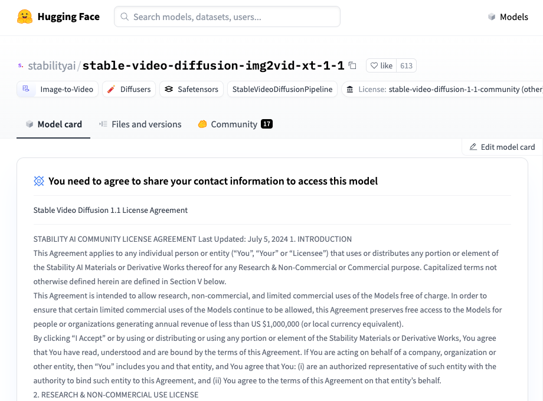
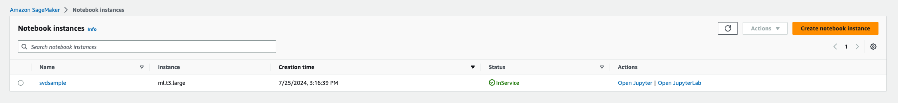
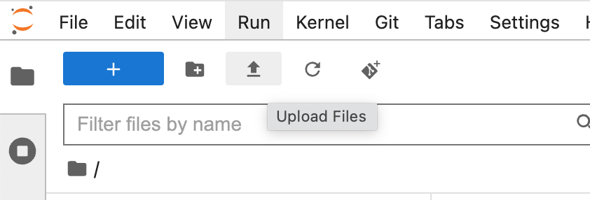
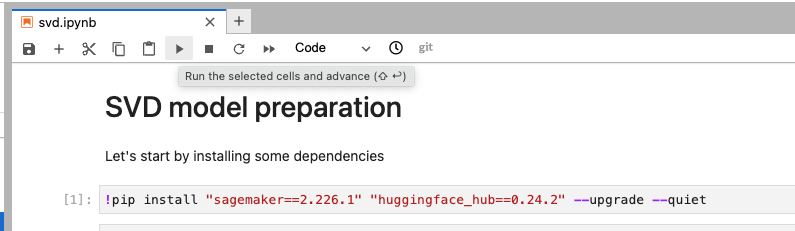

# Model preparation

## 1. Introduction

In this model preparation step, we will prepare [stable-video-diffusion-img2vid-xt-1-1](https://huggingface.co/stabilityai/stable-video-diffusion-img2vid-xt-1-1) to deploy the model to a SageMaker async inference endpoint using the [Custom endpoint construct](https://github.com/awslabs/generative-ai-cdk-constructs/blob/main/src/patterns/gen-ai/aws-model-deployment-sagemaker/README_custom_sagemaker_endpoint.md).

***Why do we need to prepare the model ? Since it is available on Hugging Face, can we not just deploy it directly ?***

The easiest way to deploy and run a Hugging Face model on a SageMaker endpoint is to use the [TGI Inference Container](https://aws.amazon.com/blogs/machine-learning/announcing-the-launch-of-new-hugging-face-llm-inference-containers-on-amazon-sagemaker/). This Hugging Face LLM DLC is powered by Text Generation Inference (TGI), an open source, purpose-built solution for deploying and serving Large Language Models. TGI enables high-performance text generation using Tensor Parallelism and dynamic batching for the most popular open-source LLMs, including StarCoder, BLOOM, GPT-NeoX, StableLM, Llama, and T5.

Unfortunately, at the time of writing this document, the TGI Inference Container doesn't support the SVD architecture.

Another option is then to use the Hugging Face inference DLC image, which uses the [SageMaker inference toolkit](https://github.com/aws/sagemaker-huggingface-inference-toolkit), an open-source library for serving Hugging Face Transformers and Diffusers models on Amazon SageMaker. This library provides default pre-processing, predict and postprocessing for certain Hugging Face Transformers and Diffusers models and tasks. It supports the pipeline feature from Transformers for zero-code deployment.

Again, unfortunately, the library doesn't support multimodal models yet (see [handler_service.py](https://github.com/aws/sagemaker-huggingface-inference-toolkit/blob/main/src/sagemaker_huggingface_inference_toolkit/handler_service.py#L156)).

***How can we deploy the model then ?***

The second option mentioned above doesn't work out of the box, however we can customize the pre and post processing code ! The Hugging Face Inference Toolkit allows the user to override the default methods of the HuggingFaceHandlerService, used for: 
- Model loading: process of deserializing your saved model back into a PyTorch model
- Serving: process of translating InvokeEndpoint requests to inference calls on the loaded model.

More information is available through the [official documentation](https://github.com/aws/sagemaker-huggingface-inference-toolkit?tab=readme-ov-file#-user-defined-codemodules). We can create a folder named code/ with an inference.py file in it (custom inference module), and if needed a requirements.txt file to add additional dependencies. 

This will allows us to override the default method used by the Hugging Face Inference Toolkit to process inference requests. 

We will in this use case extend:
- ```model_fn(model_dir)```: Before a model can be served, it must be loaded. This function overrides the default method for loading the model, the return value model will be used in the predict() for predicitions. It receives argument the model_dir, the path to your unzipped model.tar.gz
- ```predict_fn(processed_data, model)```: Takes the deserialized request object and performs inference against the loaded model. This function overrides the default method for predictions, the return value predictions will be used in the postprocess() method. The input is processed_data, the result of the preprocess() method.

***How can we inject this custom code ?***

We will use the Hugging Face inference DLC image which expects your model data to be structured as follow:
- Model files in the top-level directory
- Inference script (and any other source files) in a directory named code/
- Optional requirements file located at code/requirements.txt

For instance:

```
model.tar.gz/
|- model files
|- code/
  |- inference.py
  |- requirements.txt
```

We cannot directly upload our custom code to Hugging Face, so we will:
- Download the model artifacts
- Add our custom inference code and additional dependencies
- Compress the whole folder, and upload it to an Amazon S3 bucket

The notebook provided will walk you through the three steps above.

Finally, our CDK construct will use the S3 location of our data and the Hugging Face inference DLC image to deploy and run our async SageMaker endpoint.

## 2. Get model access

The model is gated on Hugging Face. To get access, you need to create a user access token. Keep the value of the access token as it will be used in the notebook. The procedure is detailed here: https://huggingface.co/docs/hub/security-tokens
You will need to accept to share you contact information: The model deployed in this sample requires you to agree to share your information before you can access it. Once logged in, visit the [model page](https://huggingface.co/stabilityai/stable-video-diffusion-img2vid-xt-1-1) and click on the button 'Agree and access repository'.



## 3. Prepare environment

For this example, we use a [SageMaker notebook instance](https://docs.aws.amazon.com/sagemaker/latest/dg/nbi.html) to run the provided [svd notebook](./svd.ipynb). We walk you through the creation of a new notebook instance, however you can reuse an existing instance or use SageMaker Studio. If you use Sagemaker in a local environment, you need to use an IAM Role with the required permissions for Sagemaker. More information in the [official documentation](https://docs.aws.amazon.com/sagemaker/latest/dg/sagemaker-roles.html). 

1. In Amazon SageMaker, open on the left panel side [Notebook instances](https://us-east-1.console.aws.amazon.com/sagemaker/home?region=us-east-1#/notebook-instances) under ***Notebook***.

2. Create a new notebook instance. We used here an ```ml.t3.large``` instance type. Expand the additional configuration section, and increase the value of ```Volume size in GB``` (we will download the model artifacts from Hugging Face, thus we need to ensure we have enough disk space to run all the operations. We used 100Gb for this example). Notebook instances require permissions to call other services including SageMaker and S3. Choose an existing role or let the service create a role with the [AmazonSageMakerFullAccess](https://us-east-1.console.aws.amazon.com/iam/home#/policies/arn:aws:iam::aws:policy/AmazonSageMakerFullAccess$jsonEditor) IAM policy attached. You can learn more about SageMaker roles in the [official documentation](https://docs.aws.amazon.com/sagemaker/latest/dg/sagemaker-roles.html). For this sample, we created a new role with the AmazonSageMakerFullAccess IAM policy attached.

3. When done with the configuration, proceed with ```Create a notebook instance```

4. Once the instance is ready for use (InService status), you can select it in the [Notebook instances](https://us-east-1.console.aws.amazon.com/sagemaker/home?region=us-east-1#/notebook-instances). Click then on ```Open JupyterLab```.



## 4. Run the notebook

1. Locally on your machine, clone the sample repository if not done yet:

```
git clone https://github.com/aws-samples/generative-ai-cdk-constructs-samples.git
```

2. In your instance window, select upload files and add the file [svd.ipynb](./svd.ipynb) from your local cloned repository.



> ***Note***
> As an alternative, you can also clone directly the repository in your notebook instance.

3. Once the file is uploaded, double click on the notebook in the file explorer on the left side, and a new tab will open with the content of the notebook. If prompted to select a kernel, choose ```conda_python3```.

4. Each step is described in the notebook file. Select the first cell in the notebook, then click on the "play" icon to run the cell. Make sure to replace the value of ```HF_TOKEN``` with your own suer token generated in 



5. Once you executed all the cells, save the S3 location of your model artifacts and go back to the main [README](../README.md) to deploy the solution. It should take around 40 minutes to execute all the cells.

## 5. Clean up

- Shutdown the kernel (right click on the notebook in the file explorer -> shut down kernel)
- Delete the notebook and all the files in the notebook instance
- Under notebook instances, select the notebook instance -> actions -> stop, then delete once stopped

