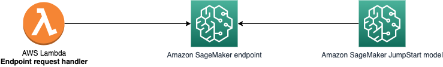

# SageMaker JumpStart model deployment

## Overview

The "SageMaker JumpStart model deployment" sample generative AI application demonstrates how to deploy and interact with a [SageMaker Foundation model](https://docs.aws.amazon.com/sagemaker/latest/dg/jumpstart-foundation-models-choose.html) leveraging AWS services and [AWS Generative AI CDK Constructs](https://github.com/awslabs/generative-ai-cdk-constructs).

Specifically, this sample deploys an AWS Lambda function which interacts with a SageMaker real-time endpoint, hosting Llama 2 7B v2.0.2. 

By providing reusable constructs following AWS best practices, this app helps you quickly build custom generative AI apps on AWS.

Here is the architecture diagram of the sample application:



## Folder Structure

This sample application codebase is organized into folders : the backend code lives in ```bin/sagemaker_jumpstart_model.ts``` and uses the AWS CDK resources defined in the ```lib``` folder.

The key folders are:

```
samples/sagemaker_jumpstart_model
│
├── bin
│   └── sagemaker_jumpstart_model.ts             # Backend - CDK app
├── lib                                          # CDK Stacks
│   ├── sagemaker_jumpstart_model-stack.ts       # Stack deploying the AWS Lambda function and SageMaker real-time endpoint
```

## Getting started

> **Warning**
> Amazon SageMaker JumpStart provides access to both publicly available and proprietary foundation models. Foundation models are onboarded and maintained from third-party open source and proprietary providers. As such, they are released under different licenses as designated by the model source. Be sure to review the license for any foundation model that you use. You are responsible for reviewing and complying with any applicable license terms and making sure they are acceptable for your use case before downloading or using the content. 
>
> Similarly, for any proprietary foundation models, be sure to review and comply with any terms of use and usage guidelines from the model provider. If you have questions about license information for a specific proprietary model, reach out to model provider directly. You can find model provider contact information in the Support tab of each model page in AWS Marketplace. To explore the latest proprietary foundation models, see Getting started with [Amazon SageMaker JumpStart](http://aws.amazon.com/sagemaker/jumpstart/getting-started/?sagemaker-jumpstart-cards.sort-by=item.additionalFields.priority&sagemaker-jumpstart-cards.sort-order=asc&awsf.sagemaker-jumpstart-filter-product-type=product-type%23foundation-model&awsf.sagemaker-jumpstart-filter-text=*all&awsf.sagemaker-jumpstart-filter-vision=*all&awsf.sagemaker-jumpstart-filter-tabular=*all&awsf.sagemaker-jumpstart-filter-audio-tasks=*all&awsf.sagemaker-jumpstart-filter-multimodal=*all&awsf.sagemaker-jumpstart-filter-RL=*all&sagemaker-jumpstart-cards.q=proprietary&sagemaker-jumpstart-cards.q_operator=AND).

To deploy this sample application, follow these steps to set up the required tools and configure your AWS environment:

### Prerequisites

- An AWS account. We recommend you deploy this solution in a new account.
- [AWS CLI](https://aws.amazon.com/cli/): configure your credentials

```
aws configure --profile [your-profile] 
AWS Access Key ID [None]: xxxxxx
AWS Secret Access Key [None]:yyyyyyyyyy
Default region name [None]: us-east-1 
Default output format [None]: json
```

- Node.js: v18.12.1
- [AWS CDK](https://github.com/aws/aws-cdk/releases/tag/v2.114.0): 2.114.0
- jq: jq-1.6
- Make sure you have sufficient quota for the instance type implemented in this sample (service Amazon SageMaker, instance type `ml.g5.2xlarge` for endpoint usage). For more information, refer to [AWS service quotas](https://docs.aws.amazon.com/general/latest/gr/aws_service_limits.html).

### Deploy the solution

This project is built using the [AWS Cloud Development Kit (CDK)](https://aws.amazon.com/cdk/). See [Getting Started With the AWS CDK](https://docs.aws.amazon.com/cdk/v2/guide/getting_started.html) for additional details and prerequisites.

1. Clone this repository.
    ```shell
    git clone https://github.com/aws-samples/generative-ai-cdk-constructs-samples.git
    ```

2. Enter the code sample backend directory.
    ```shell
    cd samples/sagemaker_jumpstart_model
    ```

3. Accept the EULA (End User License Agreement)

Some JumpStart foundation models require explicit acceptance of an end-user license agreement (EULA) before deployment. The accept_eula value is set to false by default and must be explicitly redefined as true in order to accept the end-user license agreement. 
To change this value, go to [lambda.py](./lambda/lambda.py) and update the value of ```CustomAttributes="accept_eula=false"``` to ```CustomAttributes="accept_eula=true"```. If you try to run inference while accept_eula is set to false, the inference will fail and an error message will be returned.

3. Boostrap AWS CDK resources on the AWS account.
    ```shell
    cdk bootstrap aws://ACCOUNT_ID/REGION
    ```

6. Deploy the sample in your account. 
    ```shell
    $ cdk deploy
    ```

The command above will deploy one stack in your account. With the default configuration of this sample, the observed deployment time was ~615 seconds (10 minutes).

To protect you against unintended changes that affect your security posture, the AWS CDK Toolkit prompts you to approve security-related changes before deploying them. You will need to answer yes to get all the stack deployed.

### Test

- In the AWS console, navigate to [AWS Lambda](https://us-east-1.console.aws.amazon.com/lambda/home?region=us-east-1#/functions?sb=lastModified&so=DESCENDING) and select the function named ```lambdallama2```

- Under the Code tab, click ```Test```. This will send a request to the SageMaker endpoint, and display the result. 

- You can update the parameters and prompt sent to the endpoint in the ```dic``` (file lambda.py) structure.

## Clean up

Do not forget to delete the stack to avoid unexpected charges.

```shell
    $ cdk destroy
```

Delete all the associated logs created by the different services in Amazon CloudWatch logs

# Content Security Legal Disclaimer
The sample code; software libraries; command line tools; proofs of concept; templates; or other related technology (including any of the foregoing that are provided by our personnel) is provided to you as AWS Content under the AWS Customer Agreement, or the relevant written agreement between you and AWS (whichever applies). You should not use this AWS Content in your production accounts, or on production or other critical data. You are responsible for testing, securing, and optimizing the AWS Content, such as sample code, as appropriate for production grade use based on your specific quality control practices and standards. Deploying AWS Content may incur AWS charges for creating or using AWS chargeable resources, such as running Amazon EC2 instances or using Amazon S3 storage.

# Operational Metrics Collection
This solution collects anonymous operational metrics to help AWS improve the quality and features of the solution. Data collection is subject to the AWS Privacy Policy (https://aws.amazon.com/privacy/). To opt out of this feature, simply remove the tag(s) starting with “uksb-” or “SO” from the description(s) in any CloudFormation templates or CDK TemplateOptions.