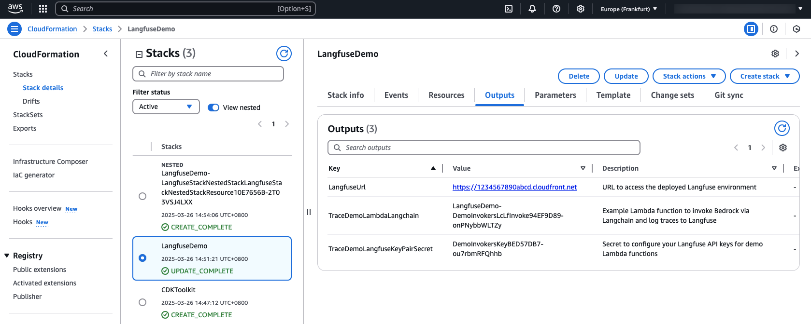
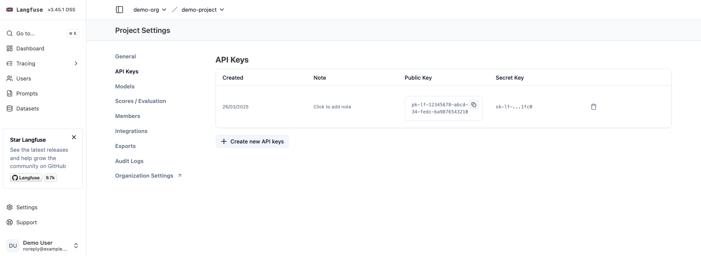
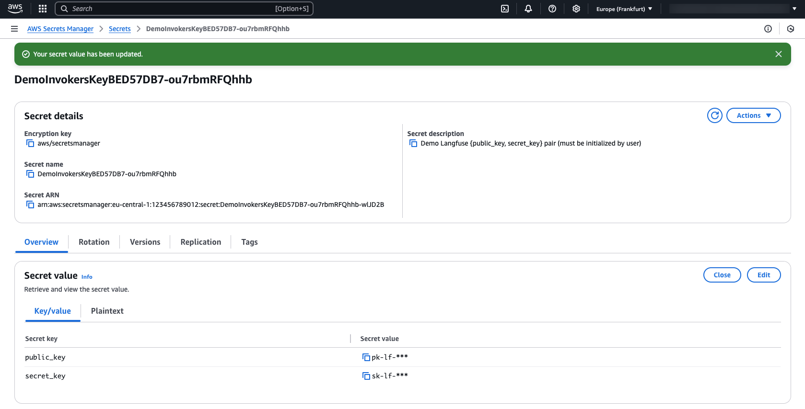
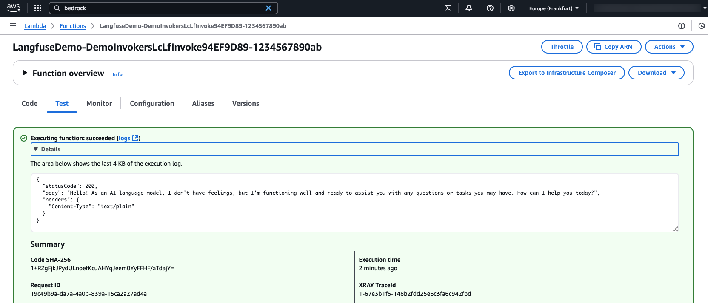
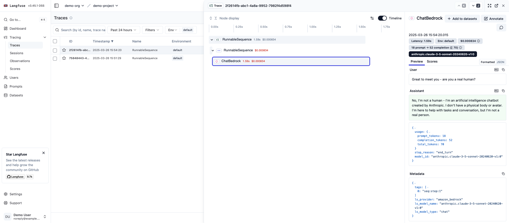

# Deploying and logging traces to Langfuse on AWS

This deployable sample application shows how to use the [CDK Constructs for deploying Langfuse on AWS](https://github.com/awslabs/generative-ai-cdk-constructs/tree/main/src/patterns/gen-ai/langfuse-deployment) from the [CDKLabs generative-ai-cdk-constructs library](https://github.com/awslabs/generative-ai-cdk-constructs): Deploying a Langfuse environment, and sending traces to it from AWS Lambda.

> :information_source: As noted in [the README](https://github.com/awslabs/generative-ai-cdk-constructs/tree/main/src/patterns/gen-ai/langfuse-deployment/README.md), the `LangfuseDeployment` construct used in this sample provides an architecture aimed at initial experimentation with the Open Source version of Langfuse. For production-ready, enterprise-grade deployments, and additional features not available in the Open Source version - check out the [Langfuse offerings through AWS Marketplace](https://aws.amazon.com/marketplace/seller-profile?id=seller-nmyz7ju7oafxu).

The sample app deploys:
1. Some **VPC infrastructure** to host components (see [LangfuseVpcInfra](https://github.com/awslabs/generative-ai-cdk-constructs/tree/main/apidocs/classes/LangfuseVpcInfra) in the construct library)
2. **Langfuse itself** (see the architecture in [the README](https://github.com/awslabs/generative-ai-cdk-constructs/tree/main/src/patterns/gen-ai/langfuse-deployment/README.md))
3. **Example Lambda Function(s)** showing how a function that invokes Amazon Bedrock can be configured to also log traces to the deployed Langfuse host.

## Pre-requisites

In the environment where you've cloned this sample, you'll need:

1. **[NodeJS v20+](https://nodejs.org/en)** installed
2. A **container build environment** to set up the containerized Python Lambda Functions
    - If your organization doesn't support [Docker Desktop](https://www.docker.com/products/docker-desktop/), you can instead try [Finch](https://runfinch.com/)
    - If using Finch instead of Docker, remember to:
        - Initialize the VM with `finch vm start`, and
        - Tell CDK how to build containers, by running `export CDK_DOCKER=finch` (on MacOS/Linux), or `SET CDK_DOCKER=finch` (on Windows)
3. **[Configured AWS CLI credentials](https://docs.aws.amazon.com/cli/latest/userguide/cli-chap-configure.html)** to call AWS APIs
    - Whichever principal you log in to AWS with (User, Role, etc) will need the relevant *IAM Permissions* to deploy and manage all types of resources used by this application - which is a pretty broad set including for example CloudWatch, ECS, ECR, EFS, Lambda, S3, and Secrets Manager.
    - In particular, you'll need permissions to manage **IAM Roles and policies** and (if nobody has yet [enabled Bedrock model access](https://docs.aws.amazon.com/bedrock/latest/userguide/model-access.html) for your AWS Account and Region) to manage **AWS Marketplace Subscriptions**. Both of these are sensitive permissions that are often restricted in large organizations.
    - You'll also want to set your target *AWS Region* for the CLI. You can check your current active AWS Account by running `aws sts get-caller-identity`, and your selected region with `aws configure get region`.

## Deploying the sample

First, you'll need to install the dependencies from this folder:

```bash
npm install
```

Then, you can deploy it to AWS:

```bash
# Deploy or update all Stacks in the app:
# (Optionally specify --require-approval never to suppress approval prompts)
npx cdk deploy --all
```

To **delete** the deployed infrastructure when you're done exploring, and avoid ongoing charges:

> ⚠️ **Warning:** Running the below will irreversibly delete any data you've stored in your deployed Langfuse instance!

```bash
npx cdk destroy --all
```

**Other useful commands** for the project include:
- `npx cdk destroy` to delete the deployed infrastructure
- `npx cdk synth` to ["synthesize"](https://docs.aws.amazon.com/cdk/v2/guide/configure-synth.html) the CDK application to deployable CloudFormation template(s), without actually deploying
- `npx cdk list` to list all CDK stacks and their dependencies


## Setting up tracing

Once the deployment is complete and your `LangfuseDemo` Stack is ready, you can start exploring how to connect the example Lambdas to the deployed Langfuse environment.

### Get your Langfuse credentials

1. Find your deployed `LangfuseUrl` from the *"Outputs"* tab of your `LangfuseDemo` Stack in the [AWS CloudFormation Console](https://console.aws.amazon.com/cloudformation/home). It should look something like: `https://1234567890abcd.cloudfront.net`



2. Open the URL in your browser and select **"Sign up"** to create a new user account. You'll need to enter your email address and choose a password.
3. Once signed up and logged in, you may be prompted to **create an organization** in Langfuse if you don't have one already - choose a name that's good for you. You can add multiple Langfuse users to your organization to share logged data.
4. Within your organization you'll then need to **create a project**: Again, choose an appropriate name for you.
5. When your project's created, you may *either*
    1. See an API key pair (like `sk-lf-....` and `pk-lf-....`) are created automatically for you - save these secret values somewhere safe. *OR*
    2. Open the project's settings in the UI and create a new API key pair for yourself.



You should now:
- Know your Langfuse "host" URL (the https://... CloudFront one)
- Know your Langfuse public/secret key pair
- Be able to log in to the Langfuse web UI, from which you can explore logged traces and data.


### Store your Langfuse credentials for AWS Lambda

The demo stack creates a (shared) AWS Secrets Manager Secret from which the invocation Lambdas will access your Langfuse API keys, so you'll need to update this secret with the keys you created above:

1. Find the `TraceDemoLangfuseKeyPairSecret` name from the *"Outputs"* tab of your `LangfuseDemo` Stack in the [AWS CloudFormation Console](https://console.aws.amazon.com/cloudformation/home).
2. Open the [AWS Secrets Manager Console](https://console.aws.amazon.com/secretsmanager/listsecrets) and find this secret from the list
    - ⚠️ **Warning:** There are multiple Langfuse-related secrets in this list - check you choose the right one!
3. Click through to the detail page for your Secret, and then click **Retrieve secret value** button.
    - You should see two fields `public_key` and `secret_key`, each set to `PLACEHOLDER` by default
4. Once you've retrieved the secret value, you should see an **Edit** button in the same place. Click it, and paste the Langfuse public and secret key pair you generated earlier into the two fields.

> Note that access to this secret value is controlled by AWS IAM configurations in your account: Other Users may be able to view and edit your keys if they've been granted permissions for the Secrets Manager service.




## Configure and test your Lambda function(s)

Check the Outputs and Resources from the LangfuseDemo stack to find the invocation demo Lambda function(s) that have been created for you. We'll take the [invoke-langchain](./assets/functions/invoke-langchain/index.py) function as an example.

Find your function in the [AWS Lambda Console](https://console.aws.amazon.com/lambda/home?#/functions), and check the settings in *Configuration > Environment variables*
- The `LANGFUSE_HOST` should be automatically configured in line with the Langfuse URL we saw earlier
- The `LANGFUSE_SECRET_ID` should match the AWS Secrets Manager Secret where you configured your Langfuse API keys above
- You may like to set a `BEDROCK_MODEL_ID` variable to override which [Amazon Bedrock Foundation Model](https://docs.aws.amazon.com/bedrock/latest/userguide/models-supported.html) the function will invoke.

The function takes a JSON payload in the format `{"inputText": "{your message}"}` and runs a very simple LangChain Chain which calls your selected Bedrock Model ID using the input, and returns the model response. For more details and to customize, see the [function source code](./assets/functions/invoke-langchain/index.py).

▶️ Go to the **Test** tab for your function in the AWS Lambda console. Create a new test event and try running the function on an example payload - something like:

```json
{
  "inputText": "Hi, how are you today?"
}
```

If all's correctly configured, the function should return successfully with the response from the Foundation Model. If not, you can click *View CloudWatch Logs* in the *Monitor* tab to find more details on what might have gone wrong.



▶️ After a successful execution, go to the Langfuse web UI and check the **Traces** panel. You should see a new trace recorded in Langfuse from your Lambda execution!



This example shows a very minimal setup for running LangChain-based LLM orchestrations serverlessly on AWS Lambda, using models on Amazon Bedrock, and logging traces to Langfuse for further inspection and analysis.
