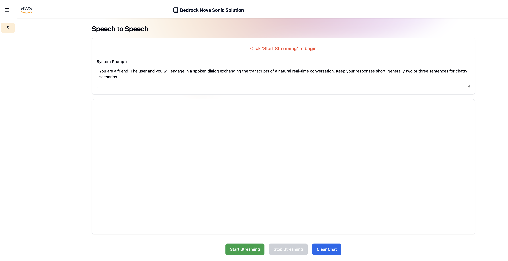

# Nova Sonic Solution

## Table of Contents

- [Nova Sonic Solution](#nova-sonic-solution)
  - [Table of Contents](#table-of-contents)
  - [Overview](#overview)
  - [Architecture](#architecture)
  - [Project Structure](#project-structure)
    - [Backend Implementation Options](#backend-implementation-options)
      - [Java WebSocket Server (Default)](#java-websocket-server-default)
      - [Python WebSocket Server](#python-websocket-server)
    - [Language Selection](#language-selection)
  - [Prerequisites](#prerequisites)
  - [Deployment](#deployment)
  - [User creation](#user-creation)
  - [Usage](#usage)
  - [Load testing](#load-testing)
  - [Clean Up](#clean-up)
  - [Content Security Legal Disclaimer](#content-security-legal-disclaimer)
  - [Operational Metrics Collection](#operational-metrics-collection)

## Overview

A real-time speech-to-speech communication platform powered by Amazon Bedrock's Nova model for advanced language processing and AWS real-time messaging capabilities, featuring a Java WebSocket server and React frontend. Nova enables natural, context-aware speech-to-speech conversations through its state-of-the-art language understanding and generation capabilities.

## Architecture


The solution consists of three main components:

1. **Frontend Application**
   - React + TypeScript application
   - Real-time WebSocket communication
   - AWS Amplify for authentication
   - Tailwind CSS for styling

2. **Backend Infrastructure**
   - AWS CDK for infrastructure as code
   - Java WebSocket server running on AWS Fargate
   - Amazon Cognito for user authentication
   - CloudFront for content delivery
   - S3 for static website hosting
   - Network Load Balancer for WebSocket traffic

3. **Development Tools**
   - Load testing suite for WebSocket performance testing
   - Automated deployment pipeline

## Project Structure

```
.
├── frontend/           # React + TypeScript frontend application
├── backend/           # AWS CDK infrastructure and Java WebSocket server
│   ├── app/          # Java WebSocket server implementation
│   ├── python_app/   # Python WebSocket server implementation
│   ├── stack/        # CDK infrastructure code
│   └── load-test/    # WebSocket load testing suite
└── images/           # Architecture diagrams and documentation images
```

### Backend Implementation Options

The solution supports two backend implementations with identical functionality:

#### Java WebSocket Server (Default)
- Java-based WebSocket server implementation
- Production-ready with comprehensive error handling
- Jetty WebSocket server with connection pooling
- Real-time speech-to-speech communication
- Cognito token validation
- Connection management and logging

#### Python WebSocket Server
- Python-based alternative implementation
- AWS Bedrock integration with `aws_sdk_bedrock_runtime` beta SDK
- Equivalent functionality to Java implementation
- **Python AWS SDK Notice**: This implementation uses the experimental AWS SDK for Python async clients. The SDK is in early development and may see rapid iteration with potential breaking changes between minor versions. For more details about the experimental AWS SDK, see: https://github.com/awslabs/aws-sdk-python/tree/develop

### Language Selection

The CDK deployment supports backend language selection:

- **Java (default)**: `cdk deploy`
- **Python**: `cdk deploy --context custom:backendLanguage=python`

The `cdk.json` file contains the context parameter `custom:backendLanguage` (set to "python" for Python deployment).

## Prerequisites

- [Python](https://www.python.org/downloads/) 3.11 or higher
- [Docker Desktop](https://docs.docker.com/desktop/install/)
- [Gradle](https://gradle.org/install/) 7.x or higher
- [Git](https://git-scm.com/downloads)
- [AWS CDK Toolkit](https://docs.aws.amazon.com/cdk/v2/guide/cli.html)
- [AWS CLI](https://docs.aws.amazon.com/cli/latest/userguide/install-cliv2.html)
```
aws configure --profile [your-profile] 
AWS Access Key ID [None]: xxxxxx
AWS Secret Access Key [None]:yyyyyyyyyy
Default region name [None]: us-east-1 
Default output format [None]: json
```
- Node.js: v18.12.1 or higher
- npm 8.x or higher
- Ensure you enable model access to Amazon Nova Sonic in the [Bedrock console](https://us-east-1.console.aws.amazon.com/bedrock/home?region=us-east-1#/modelaccess) in the region you intend to deploy this sample. For an up to date list of supported regions for Amazon Nova Sonic, please refer to the [documentation](https://docs.aws.amazon.com/bedrock/latest/userguide/models-regions.html)
- Chrome, Safari, or Edge browser environment (Firefox is currently not supported)
- Microphone and speakers

## Deployment

1. If not done already, clone this repository:

   ```shell
   $ git clone https://github.com/aws-samples/generative-ai-cdk-constructs-samples.git
   ```

2. Enter the sample directory:

   ```shell
   $ cd samples/speech-to-speech
   ```

3. Build the frontend first:

   ```shell
   $ cd frontend
   ```

   Install dependencies:

   ```shell
   $ npm install
   ```

   Build the web application

   ```shell
   $ npm run build
   ```

The build output in `frontend/dist/` directory will be automatically deployed by the backend CDK stack to S3 and served through CloudFront. The environment variables are automatically configured by the `custom_resource_construct.py` in the CDK stack, which updates the frontend configuration during deployment.

4. Go to the backend directory:

   ```shell
   $ cd ../backend
   ```

5. Create a virtualenv on MacOS and Linux:

   ```shell
   $ python3 -m venv .venv
   ```

   After the init process completes and the virtualenv is created, you can use the following
   step to activate your virtualenv.

   ```shell
   $ source .venv/bin/activate
   ```

   If you are a Windows platform, you would activate the virtualenv like this:

   ```shell
   $ .venv\Scripts\activate.bat
   ```

6. Once the virtualenv is activated, you can install the required dependencies.

   ```shell
   $ pip install -r requirements.txt
   ```

7. Run the following to bootstrap your account:

   ```shell
   $ cdk bootstrap
   ```

8. Run AWS CDK Toolkit to deploy the Backend stack with the runtime resources.

   ```shell
   $ cdk deploy --require-approval=never
   ```

   Any modifications made to the code can be applied to the deployed stack by running the same command again.

   ```shell
   cdk deploy --require-approval=never
   ```

The command above will deploy one stack in your account. With the default configuration of this sample, the observed deployment time was ~646 seconds (10.5 minutes).

Get the CloudFront domain name:

```shell
aws cloudformation describe-stacks \
  --stack-name NovaSonicSolutionBackendStack \
  --query 'Stacks[0].Outputs[?OutputKey==`CloudFrontDistributionDomainName`].OutputValue' \
  --output text
```

The frontend can be accessed at the domain name above (XXXX.cloudfront.net).

## User creation

First, locate the Cognito User Pool ID, through the AWS CLI:

```shell
$ aws cloudformation describe-stacks --stack-name NovaSonicSolutionBackendStack --query "Stacks[0].Outputs[?contains(OutputKey, 'UserPoolId')].OutputValue"

[
    "OutputValue": "<region>_a1aaaA1Aa"
]
```

1. Navigate to AWS Console:
2. Search for "Cognito" in the AWS Console search bar, Click on "Cognito" under Services, Click on "User Pools" in the left navigation.
   Find and click on the User Pool created by the CDK stack you recovered above.
3. In the User Pool dashboard, click "Users" in the left navigation. Click the "Create user" button and create user with password.

## Usage

1. Open your browser and go to the application URL (CloudFront domain from CDK outputs) previously recovered.
2. Click on "Speech to Speech" in the sidebar navigation menu.
3. Click the "Start Streaming" button. When prompted, allow access to your microphone.
4. Begin speaking - you should see your speech being transcribed in real-time on the UI
5. The assistant will automatically process your message and respond through speech
6. Click "Stop Streaming" when you're done


   
> Note: Ensure your microphone is properly connected and working before testing. The browser may require you to grant microphone permissions the first time you use the feature.

## Load testing

The [backend/load-test](backend/load-test/) directory contains [Artillery](https://www.artillery.io/docs) scripts for WebSocket performance testing. This will require the installation of [Artillery](https://www.artillery.io/docs/get-started/get-artillery).

1. Set up load testing:

   ```shell
   $ cd backend/load-test
   $ npm install
   $ ./setup-load-test.sh
   ```

2. Run load tests:

   ```shell
   $ ./run-load-test.sh
   ```

3. Generate HTML report

   ```shell
   $ artillery report report.json
   ```

## Clean Up

Do not forget to delete the stack to avoid unexpected charges.

```shell
cdk destroy NovaSonicSolutionBackendStack
```

Delete the associated logs created by the different services in Amazon CloudWatch logs.

Ensure S3 buckets are emptied before deletion.

## Content Security Legal Disclaimer

The sample code; software libraries; command line tools; proofs of concept; templates; or other related technology (including any of the foregoing that are provided by our personnel) is provided to you as AWS Content under the AWS Customer Agreement, or the relevant written agreement between you and AWS (whichever applies). You should not use this AWS Content in your production accounts, or on production or other critical data. You are responsible for testing, securing, and optimizing the AWS Content, such as sample code, as appropriate for production grade use based on your specific quality control practices and standards. Deploying AWS Content may incur AWS charges for creating or using AWS chargeable resources, such as running Amazon EC2 instances or using Amazon S3 storage.

## Operational Metrics Collection

This solution collects anonymous operational metrics to help AWS improve the quality and features of the solution. Data collection is subject to the AWS Privacy Policy (https://aws.amazon.com/privacy/). To opt out of this feature, simply remove the tag(s) starting with “uksb-” or “SO” from the description(s) in any CloudFormation templates or CDK TemplateOptions.
