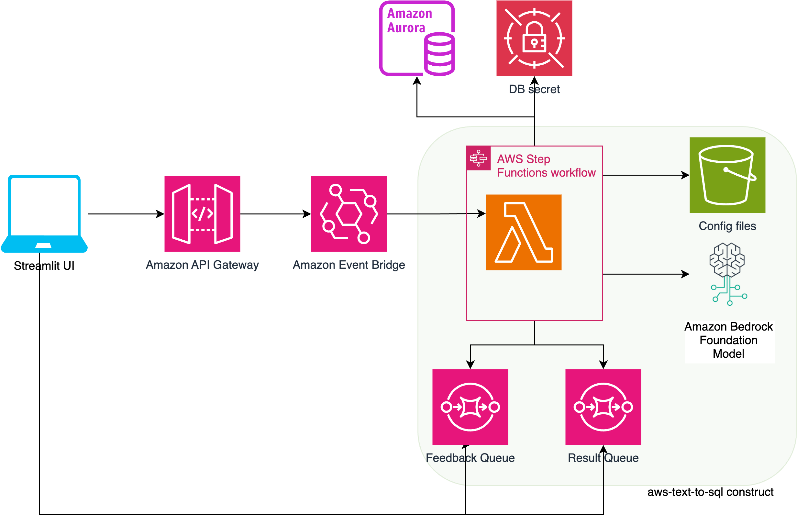

# Text To SQL

The "Text To SQL" generative AI sample application is a cutting-edge solution that enables users to interact with databases through natural language queries, eliminating the need for extensive SQL knowledge. This application leverages the powerful Anthropic Claude 3 model, hosted on Amazon Bedrock, to translate natural language queries into executable SQL statements seamlessly.

At the core of the application lies a sophisticated query interpretation process. The application first analyzes the user's natural language query, disambiguating any ambiguities by reformulating the question based on the database schema. This crucial step ensures that the query is accurately interpreted and aligned with the underlying data structure, ensuring precise and relevant results.

Once the question is reformulated, the application generates the corresponding SQL query using advanced natural language processing and machine learning techniques. If configured for feedback, the application presents the reformulated question and the generated query to the user, allowing them to either confirm or modify the input. This feedback loop ensures that the generated query accurately reflects the user's intent, fostering a collaborative and iterative querying experience.

Users have the flexibility to skip query execution by modifying the configuration files. In this mode, the application returns only the generated SQL query without executing it against the database, enabling users to review and validate the query before execution.

In the event of a query execution failure, the application enters an auto-correction mode, leveraging its advanced algorithms to generate alternative queries for a specified number of maximum retries. This robust feature enhances the system's resilience, increasing the likelihood of successful query execution and minimizing user frustration.

Furthermore, the application captures and displays key query metrics on the user interface, providing valuable insights into the performance and efficiency of the generated SQL queries. These metrics serve as benchmarks, enabling users to optimize their queries and ensure optimal database performance.

Underpinning this powerful application is the Generative AI CDK (aws-text-to-sql) construct, a robust framework developed by AWS to facilitate the seamless integration of generative AI capabilities into applications. 

Overall, the "Text To SQL" generative AI sample application change the way users interact with databases, bridging the gap between natural language and complex SQL queries. 


## Architecture



## Folder Structure

This sample application codebase is organized into folders : the backend code lives in ```bin/text-to-sql.ts``` and uses the AWS CDK resources defined in the ```lib``` folder.

The key folders are:

```
samples/text-to-sql
│
├── bin
│   └── text-to-sql.ts                  # CDK app
├── lib                                 # CDK Stacks
│   ├── text-to-sql-stack.ts         # Stack deploying the S3 bucket, Bedrock Agent, Action Group, and Knowledge Base
├── client_app                                # Streamlit  
│   └── pages
        └── 1_🤖_text_to_sql_client.py   
        └── 2_📈_text_to_sql_metrics.py           
    └── Home.py                               # Streamlit landing 
```

## Getting Started

To deploy this Text to SQL application, follow these steps to set up the required tools and configure your AWS environment:

### Prerequisites

* An AWS account.
* AWS CLI: configure your credentials

aws configure --profile [your-profile]
AWS Access Key ID [None]: xxxxxx
AWS Secret Access Key [None]:yyyyyyyyyy
Default region name [None]: us-east-1
Default output format [None]: json

* Node.js: v18.12.1
* AWS CDK: 2.68.0
* jq: jq-1.6
* Docker - This sample builds a Lambda function from a Docker image, thus you need [Docker desktop](https://www.docker.com/products/docker-desktop/) running on your machine.

### Deploy the solution

This project is built using the [AWS Cloud Development Kit (CDK)](https://aws.amazon.com/cdk/). See [Getting Started With the AWS CDK](https://docs.aws.amazon.com/cdk/v2/guide/getting_started.html) for additional details and prerequisites.

1. Clone this repository.

   ```shell
   git clone https://github.com/aws-samples/generative-ai-cdk-constructs-samples.git
   ```
2. Enter the code sample backend directory.

   ```shell
   cd samples/text-to-sql
   ```
3. Install packages

   ```shell
   npm install
   ```
4. Boostrap AWS CDK resources on the AWS account.

   ```shell
   cdk bootstrap aws://ACCOUNT_ID/REGION
   ```
5. Enable Access to Amazon Bedrock Models

> You must explicitly enable access to models before they can be used with the Amazon Bedrock service. Please follow these steps in the [Amazon Bedrock User Guide](https://docs.aws.amazon.com/bedrock/latest/userguide/model-access.html) to enable access to the models (at minimum, ```Anthropic::Claude```):.

7. Deploy the sample in your account.

   ```shell
   $ cdk deploy --all
   ```
8. ## Database Setup
If you're using the default database service with the construct, you'll need to follow these steps to create the database and insert values into the tables using the script This sample application use ``` /client_app/config_files/Chinook_MySql.sql ``` file.

Create an EC2 instance and SSH into it:

Create a new key pair (if you don't have one already):
```
aws ec2 create-key-pair --key-name dbsetup --query 'KeyMaterial' --output text > dbsetup.pem
```
Launch EC2 Amazon linux instance
```
aws ec2 run-instances --image-id ami-0cff7528ff583bf9a --count 1 --instance-type t2.medium --key-name MyKeyPair --security-group-ids <lambda_security_group> --subnet-id <YOUR_public_SUBNET_ID> --associate-public-ip-address --tag-specifications 'ResourceType=instance,Tags=[{Key=Name,Value=dbsetup}]'
```

<!-- aws ec2 run-instances --image-id ami-0cff7528ff583bf9a --count 1 --instance-type t2.medium --key-name dbsetupv2 --security-group-ids sg-0c7f5db46421d72b4 --subnet-id subnet-0bbfae2f483b73c42 --associate-public-ip-address --tag-specifications 'ResourceType=instance,Tags=[{Key=Name,Value=dbsetupv2}]' -->

Add inbound rules to security group
```
aws ec2 authorize-security-group-ingress \
    --group-id <lambda_security_group> \
    --protocol tcp \
    --port 22 \
    --cidr <YOUR_LOCAL_PUBLIC_IP>/32
``` 
    
Add inbound rules to NACL 

```
aws ec2 create-network-acl-entry \
    --network-acl-id <nacl-id> \
    --rule-number <rule-number> \
    --protocol tcp \
    --port-range From=22,To=22 \
    --cidr-block <YOUR_LOCAL_PUBLIC_IP>/32 \
    --rule-action allow \
    --ingress
```
SSH to EC2 machine

```
ssh -i /path/to/key.pem ec2-user@<ec2-instance-public-ip>
```

Once your are able to access the EC2 instance, next step is to run the db script with MySql client.

Update the system packages:
   ```
   sudo dnf update -y
   ```

 Install MariaDB:
   ```
   sudo dnf install mariadb105
   ```

Transfer the SQL script file from your local machine to the EC2 instance:
   
```
scp -i /path/to/key.pem /path/to/script-file.sql ec2-user@<ec2-instance-public-ip>:/home/ec2-user/
```

Update AWS Secret with DB credentials

 ```
aws secretsmanager put-secret-value \
    --secret-id texttosqldbsecret \
    --secret-string file://<PATH TO DB.SQL>
 ```

Connect to the Aurora MySQL cluster:
```
mysql -h <myauroracluster.cluster-xyz.us-east-1.rds.amazonaws.com> -P 3306 -u <myuse> -p
   ```

Enter the password when prompted.

** Add master password through console

Run the SQL script:
```sql
SOURCE /home/ec2-user/Chinook_MySql.sql
```

Verify the database and table names:
```sql
SHOW DATABASES;
USE database_name;
SHOW TABLES;
   ```

## Run the Streamlit UI

Configure client_app

```shell
cd client_app
python -m venv venv
source venv/bin/activate
pip install -r requirements.txt
```

Still within the /client_app directory, create an ```.env``` file with the following content. Replace the property values with the values retrieved from the stack outputs/console.

```
COGNITO_DOMAIN="<TextToSqlStack.CognitoDomain>"
REGION="<TextToSqlStack.Region>"
USER_POOL_ID="<TextToSqlStack.UserPoolId>"
CLIENT_ID="<TextToSqlStack.ClientId>"
CLIENT_SECRET="COGNITO_CLIENT_SECRET"
IDENTITY_POOL_ID="<TextToSqlStack.IdentityPoolId>"
APP_URI="http://localhost:8501/"
AUTHENTICATED_ROLE_ARN="<TextToSqlStack.AuthenticatedRoleArn>"
FEEDBACK_QUEUE ="<TextToSqlStack.FEEDBACK_QUEUE>"
RESULT_QUEUE = "<TextToSqlStack.RESULT_QUEUE>"
FEEDBACK_ENDPOINT="<TextToSqlStack.FEEDBACK_ENDPOINT>"
CONFIG_BUCKET="<TextToSqlStack.CONFIG_BUCKET>"

```

Note: The ```COGNITO_CLIENT_SECRET``` is a secret value that can be retrieved from the AWS Console. Go to the [Amazon Cognito page](https://console.aws.amazon.com/cognito/home) in the AWS console, then select the created user pool. Under App integration, select App client settings. Then, select Show Details and copy the value of the App client secret.

10. Run client_app
    ```shell
    streamlit run Home.py
    ```

### Test

- Open the browser and go to http://localhost:8501/
- Click login and sign up a user for the first time access.
- Click on ```Insight to Data``` on left panel.
- Ask sample question "How many makers are there?"

## Config files
- Update workflow_config.json file  of the aws-text-to-sql construct with this sample app config files

## Clean up

Do not forget to delete the stack to avoid unexpected charges.

First make sure to remove all data from the Amazon Simple Storage Service (Amazon S3) Buckets. Then:

```shell
    $ cdk destroy --all
```

Then in the AWS Console delete the S3 buckets.


# Content Security Legal Disclaimer

The sample code; software libraries; command line tools; proofs of concept; templates; or other related technology (including any of the foregoing that are provided by our personnel) is provided to you as AWS Content under the AWS Customer Agreement, or the relevant written agreement between you and AWS (whichever applies). You should not use this AWS Content in your production accounts, or on production or other critical data. You are responsible for testing, securing, and optimizing the AWS Content, such as sample code, as appropriate for production grade use based on your specific quality control practices and standards. Deploying AWS Content may incur AWS charges for creating or using AWS chargeable resources, such as running Amazon EC2 instances or using Amazon S3 storage.

# Operational Metrics Collection

This solution collects anonymous operational metrics to help AWS improve the quality and features of the solution. Data collection is subject to the AWS Privacy Policy (https://aws.amazon.com/privacy/). To opt out of this feature, simply remove the tag(s) starting with “uksb-” or “SO” from the description(s) in any CloudFormation templates or CDK TemplateOptions.
